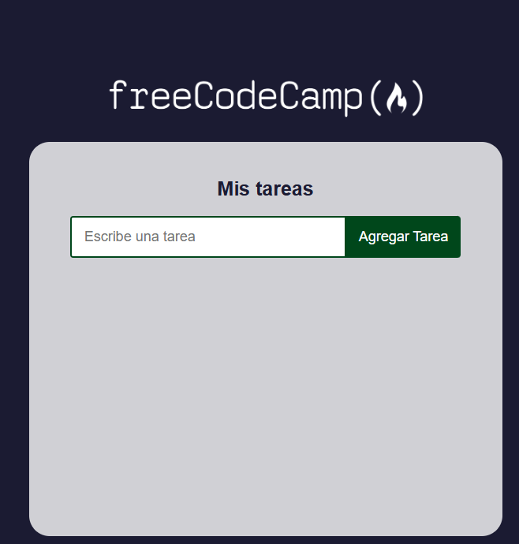
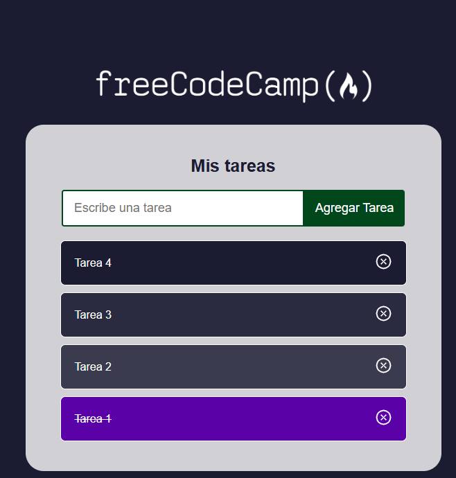
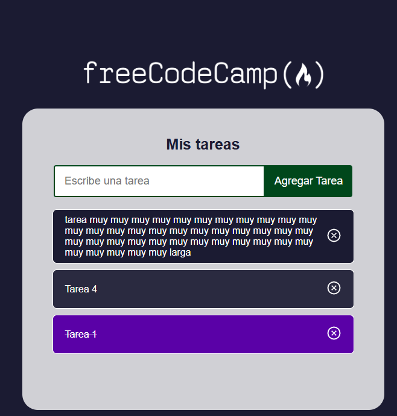

# React Task Manager 

---

## About this project

This project is a React-based **task management application** inspired by the [FreeCodeCamp React course](https://youtu.be/6Jfk8ic3KVk?si=1JTnm9AginYkZrI0&t=19605). Users can create, complete, and delete tasks in real time. The state of the task list is dynamically updated using `useState`, and tasks are rendered as reusable components.

This application serves as an introduction to React fundamentals, covering component-based architecture, props, events, dynamic rendering, and unique ID generation. It also includes visual enhancements and interactivity with the use of external libraries such as `react-icons`.

---

## Technologies and Versions

* **React 18.x** — Frontend framework
* **JavaScript (ES6+)** — JSX, arrow functions, destructuring
* **CSS3** — Custom component styling and layout
* **[uuid@9.x](mailto:uuid@9.x)** — Unique ID generator for task items
* **[react-icons@4.x](mailto:react-icons@4.x)** — Icon support (`AiOutlineCloseCircle`)
* **Create React App (CRA)** — Starter boilerplate used in current version

---

## Features (Things Learned)

* Functional task manager built entirely with React
* `Formulario` component updates parent state (`ListaDeTareas`) via `props.onSubmit`
* Controlled form input using `setInput(e.target.value)`
* Unique IDs assigned to tasks using `uuidv4()` from the `uuid` package
* Task list rendered with `.map()`, using `key={tarea.id}` for reconciliation
* Mark tasks as completed using `completarTarea(id)`
* Remove tasks with `eliminarTarea(id)` triggered by icon click
* Reusable task component `<Tarea />` receives props including handler functions
* Conditional rendering via ternary class assignment (`completada ? ...`)
* Semantic UI improvements: `<button>`, `role`, `aria-label`, `tabIndex`
* Fragment (`<>...</>`) syntax to avoid unnecessary wrappers
* Safe text wrapping with `overflow-wrap: anywhere` in `.tarea-texto`
* Visual color gradient applied using `:nth-child(3n + 1)`, `(3n + 2)`, etc. in CSS
* Error prevention best practice: always ensure `onClick` handlers are inside components

---

## Known Notes & Developer Reminders

* ✅ `className='tarea-icono'` is passed as a prop — it’s not an assignment.
* ⚠️ Avoid forgetting to place `onClick` handlers **inside components**.
* 🔁 Replacing CRA with Vite is recommended for future performance gains.
* ✅ Ensure `setTareas()` is passed updated state — empty call leads to bugs.

---

## Setup and Running

1. Clone the repository:

   ```bash
   git clone https://github.com/estefaniacn/aplicacion-tareas-react.git
   ```

2. Navigate to the project folder:

   ```bash
   cd aplicacion-tareas-react
   ```

3. Install dependencies:

   ```bash
   npm install
   ```

4. Start the development server:

   ```bash
   npm start
   ```

5. Visit the app at: [http://localhost:3000](http://localhost:3000)

---

## Project Structure Overview

```
/src
├── App.js                      # Main wrapper component
├── index.js                   # Entry point for React DOM
├── /componentes
│   ├── Formulario.jsx         # Controlled form input
│   ├── ListaDeTareas.jsx      # Core logic: state & task list
│   └── Tarea.jsx              # Individual task component
├── /hojas-de-estilo           # CSS modules
│   ├── Formulario.css
│   ├── ListaDeTareas.css
│   └── Tarea.css              # Task styles with color gradient
└── /imagenes
    ├── scsh-01.png
    ├── scsh-02.png
    └── scsh-03.png
```

---

## Screenshots

<p align="center">
  
  
  
</p>

---

## Useful Scripts

In the project directory, you can run:

* `npm start` — Launch the development server
* `npm run build` — Create a production-ready build
* `npm test` — Run any configured tests
* `npm run eject` — Ejects CRA configs *(advanced users only)*

For more, see [Create React App documentation](https://create-react-app.dev/).

---

## References

* 📘 React Fundamentals — FreeCodeCamp YouTube Series
  [https://youtu.be/6Jfk8ic3KVk?si=1JTnm9AginYkZrI0\&t=19605](https://youtu.be/6Jfk8ic3KVk?si=1JTnm9AginYkZrI0&t=19605)
* 🔗 FCC GitHub Repo:
  [https://github.com/estefaniacn/aplicacion-tareas-react](https://github.com/estefaniacn/aplicacion-tareas-react)
* 🔧 UUID Docs: [https://www.npmjs.com/package/uuid](https://www.npmjs.com/package/uuid)
* 🎨 React Icons: [https://react-icons.github.io/react-icons/](https://react-icons.github.io/react-icons/)


