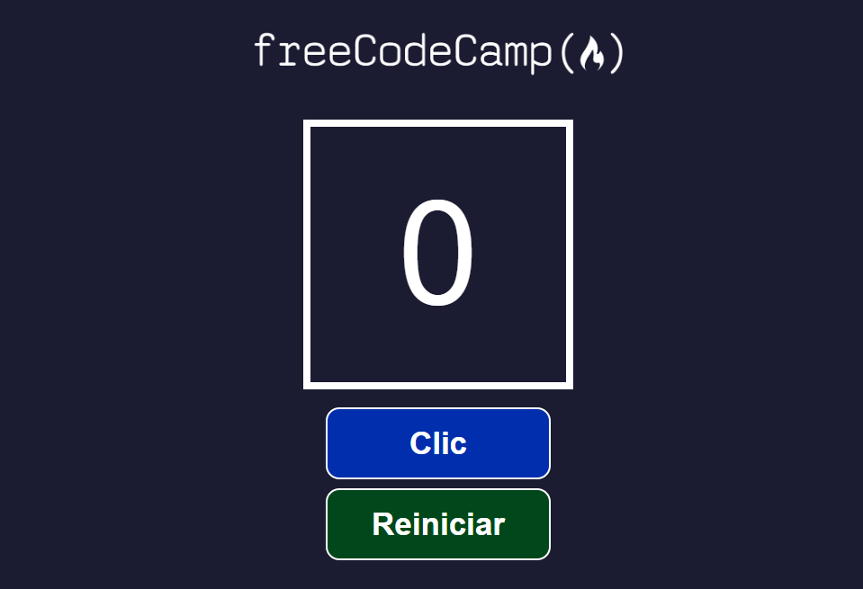

# Contador de Clics – React Project

> Proyecto 2 from the 2022 React Fundamentals course  
> Finished: **May 2025**  
> Tutorial: https://youtu.be/6Jfk8ic3KVk?si=VELkHbJLNgoijYbg&t=10160

---

## About this project

This React application implements a simple click counter with two interactive buttons: one to increment the count and another to reset it. It’s the second project in a series built during the freeCodeCamp React Fundamentals course on YouTube.

The app introduces key concepts such as **React Hooks** (`useState`) for state management, **arrow functions** for event handling, and **destructuring** of props for clean, modular code. Although `import React from "react"` is no longer required in modern versions of React, it is included here as a best practice per the tutorial’s recommendations.

The interface is styled using modular CSS files and is responsive to common screen sizes.

---

## Technologies and Versions

- **React 18.x** — Frontend framework  
- **JavaScript (ES6+)** — JSX, arrow functions, destructuring  
- **CSS3** — Component-based styling, layout and visual feedback  
- **Create React App (CRA)** — Project scaffolding (`npx create-react-app [folder-name]`)

---

## Features

- React state managed using the `useState` hook  
  - `numClics` is initialized to 0  
  - The `manejarClic` function updates the count using `setNumClics(numClics + 1)`  
  - The `reiniciarContador` function resets the count to zero  
- Props are passed using ES6 destructuring in child components (`Contador`, `Boton`)  
- Arrow functions are used for concise and predictable callback handling  
- Semantic HTML with accessible image alt attributes  
- Clean separation of concerns with dedicated component and style folders  

---

## Setup and Running

1. Clone the repository:  
   ```bash
   git clone https://github.com/your-username/contador-de-clics.git
```

2. Navigate into the project folder:

   ```bash
   cd contador-de-clics
   ```
3. Install dependencies:

   ```bash
   npm install
   ```
4. Start the development server:

   ```bash
   npm start
   ```
5. Open [http://localhost:3000](http://localhost:3000) in your browser.

---

## Project Structure Overview

* `/src/componentes` — React components: `Boton.jsx`, `Contador.jsx`
* `/src/imagenes` — Static images and screenshots
* `/src/hojas-de-estilo` — CSS files (`boton.css`, `contador.css`)
* `/src/App.js` — Main component holding the application logic
* `/src/index.js` — React entry point

---

## Useful Scripts

In the project directory, you can run:

* `npm start` — Runs the app in development mode
* `npm run build` — Builds the app for production
* `npm test` — Runs test watcher
* `npm run eject` — Ejects CRA configs (advanced use only)

More info: [Create React App documentation](https://facebook.github.io/create-react-app/docs/getting-started)

---

## Screenshots

<table>
  <tr>
    <td></td>
    <td></td>
  </tr>
  <tr>
    <td></td>
    <td></td>
  </tr>
</table>

---

## References

* The exercise comes from the 2022 React tutorial:
  [https://youtu.be/6Jfk8ic3KVk?si=VELkHbJLNgoijYbg\&t=10160](https://youtu.be/6Jfk8ic3KVk?si=VELkHbJLNgoijYbg&t=10160)
* GitHub repository for Proyecto 2:
  [https://github.com/estefaniacn/contador-de-clics-freecodecamp](https://github.com/estefaniacn/contador-de-clics-freecodecamp)
* **Note to self:** Used `npx create-react-app` to scaffold due to older tutorial context.

---

## Acknowledgements

* Built while following the freeCodeCamp React Fundamentals curriculum
* Thanks to freeCodeCamp and Estefanía C.N. for their excellent educational content
