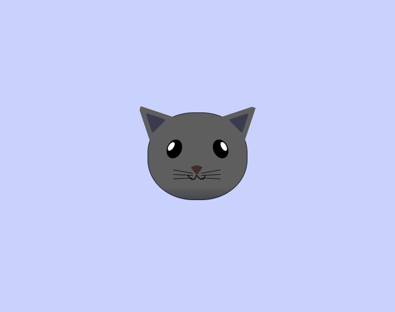

# Cat Painting with HTML & CSS

A creative HTML/CSS project that builds a stylized cat face using absolute positioning, z-index layering, and CSS transforms. This intermediate-level exercise strengthens your ability to control layout precision, stacking order, and visual transformations — all using pure HTML and CSS.

## Technologies Used

- **HTML5** – Semantic, nested structure for building visual parts
- **CSS3** – Absolute positioning, layering with z-index, transform property

## Main Features

- Absolute positioning to place each cat part with pixel-perfect accuracy
- Z-index stacking for realistic ear and whisker layering
- Border tricks and radius values to shape ears, eyes, and nose
- Transform rotations for subtle tilts and visual realism
- Div-based structure for maximum layout control

## Setup Instructions

1. Download or clone this repository.
2. Ensure both `index.html` and `styles.css` are in the same directory.
3. Open `index.html` in your web browser.

## How to Use It

- Inspect how each facial feature is layered using `position: absolute` and `z-index`.
- Experiment with `transform: rotate()` to adjust tilt and expression.
- Try modifying whisker angle, eye position, or ear shape using `top`, `left`, and `border` values.
- Use this layout to practice complex CSS positioning and visual structure.

## Project Status

✅ Completed as a CSS positioning and layering practice exercise.

## Screenshot

## Acknowledgements

- Based on [freeCodeCamp’s Intermediate CSS Project – Cat Painting](https://www.freecodecamp.org/learn/2022/responsive-web-design/learn-intermediate-css-by-building-a-cat-painting/)

## Quick Reference Steps

<table>
  <tr>
    <td><strong>Step 7</strong> Draws the cat's head using <code>border-radius</code></td>
    <td><strong>Steps 9–14</strong> Explains CSS positioning: Static, Relative, Absolute, Fixed, Sticky</td>
    <td><strong>Steps 22–23</strong> CSS trick to draw triangles using <code>border</code> shorthand</td>
  </tr>
  <tr>
    <td><strong>Step 25</strong> Creates the left ear</td>
    <td><strong>Step 27</strong> Applies <code>transform</code> to rotate the left ear</td>
    <td><strong>Step 28</strong> Creates the right ear</td>
  </tr>
  <tr>
    <td><strong>Step 37</strong> Draws the left inner ear</td>
    <td><strong>Step 38</strong> Draws the right inner ear</td>
    <td><strong>Step 43</strong> Positions the left eye</td>
  </tr>
  <tr>
    <td><strong>Step 48</strong> Positions the right eye</td>
    <td><strong>Step 49</strong> Adds white inner reflection to the left eye</td>
    <td><strong>Step 51</strong> Adds white inner reflection to the right eye</td>
  </tr>
  <tr>
    <td><strong>Step 54</strong> Draws the nose using rotated triangle</td>
    <td><strong>Step 69</strong> Creates left-side whiskers</td>
    <td><strong>Step 77</strong> Creates right-side whiskers</td>
  </tr>
</table>
