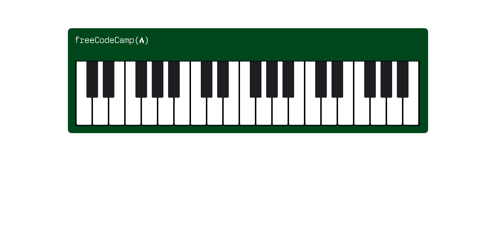
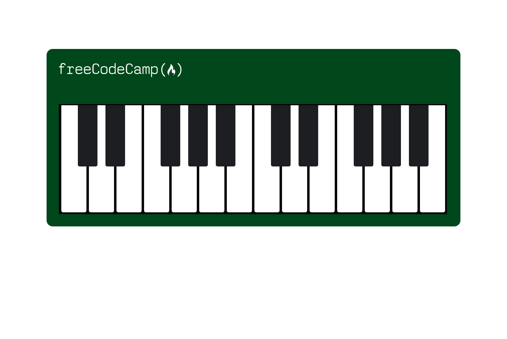
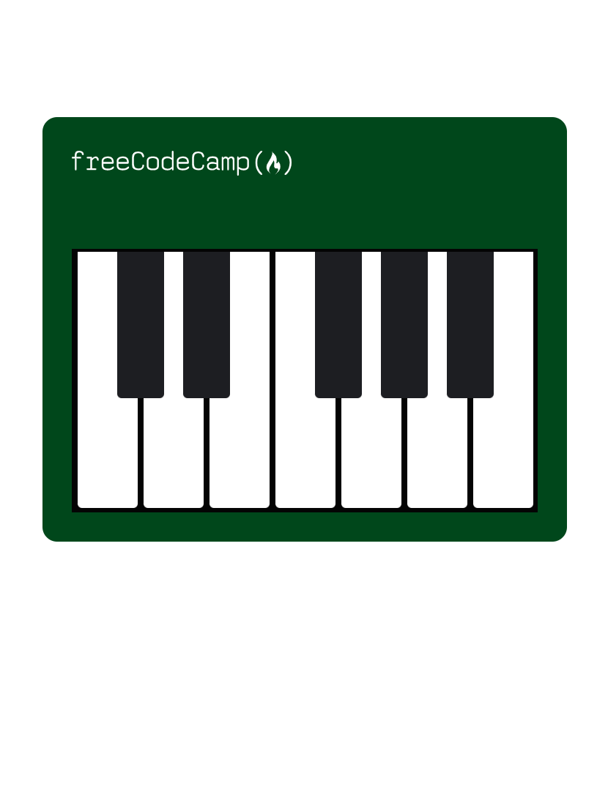

# Piano with Responsive HTML & CSS

A responsive HTML/CSS project that visually recreates a stylized piano using layout techniques and media queries. This exercise emphasizes the principles of responsive design, positioning strategies, and creative use of pseudo-selectors — all built with semantic HTML and custom-styled CSS.

## Technologies Used

- **HTML5** – Semantic structure for visual layout
- **CSS3** – Box model, positioning, pseudo-selectors, media queries

## Main Features

- Uses **absolute and relative positioning** for layered key design
- Implements **pseudo-elements** to create black keys using `::after`
- **Responsive layout** that adapts across screen sizes using `@media` queries
- **Custom styling** using margins, padding, and border-radius to mimic real-world piano shape
- Incorporates **overflow management** to clip visual overflow cleanly
- Includes a **positioned logo** for branding and header layout

## Setup Instructions

1. Download or clone this repository.
2. Ensure both `index.html` and `styles.css` are in the same directory.
3. Open `index.html` in your web browser.

## How to Use It

- Resize the browser window to observe how the piano layout adjusts at different breakpoints.
- Experiment with `position`, `z-index`, and `transform` values to alter how black keys are layered.
- Tweak the media query breakpoints or add more keys to deepen your CSS layout skills.
- Use this project to practice **responsive design principles** in a creative context.

## Project Status

✅ Completed as a layout and positioning practice exercise with a focus on responsive design.

## Screenshots

| Default Layout | Medium Screen | Mobile Layout |
|----------------|----------------|----------------|
|  |  |  |

## Acknowledgements

- Inspired by [freeCodeCamp’s Responsive Web Design Project](https://www.freecodecamp.org/learn/2022/responsive-web-design/learn-responsive-web-design-by-building-a-piano/)

## Quick Reference Steps

<table>
  <tr>
    <td><strong>Step 5</strong> Keys in HTML</td>
    <td><strong>Step 17</strong> White Keys</td>
    <td><strong>Step 18–20</strong> Black Keys with ::after</td>
  </tr>
  <tr>
    <td><strong>Step 21</strong> Logo Element</td>
    <td><strong>Step 23</strong> Position Relative on Parent</td>
    <td><strong>Step 27</strong> @media Query for Responsiveness</td>
  </tr>
  <tr>
    <td><strong>Step 31</strong> Overflow: Hidden</td>
    <td></td>
    <td></td>
  </tr>
</table>
