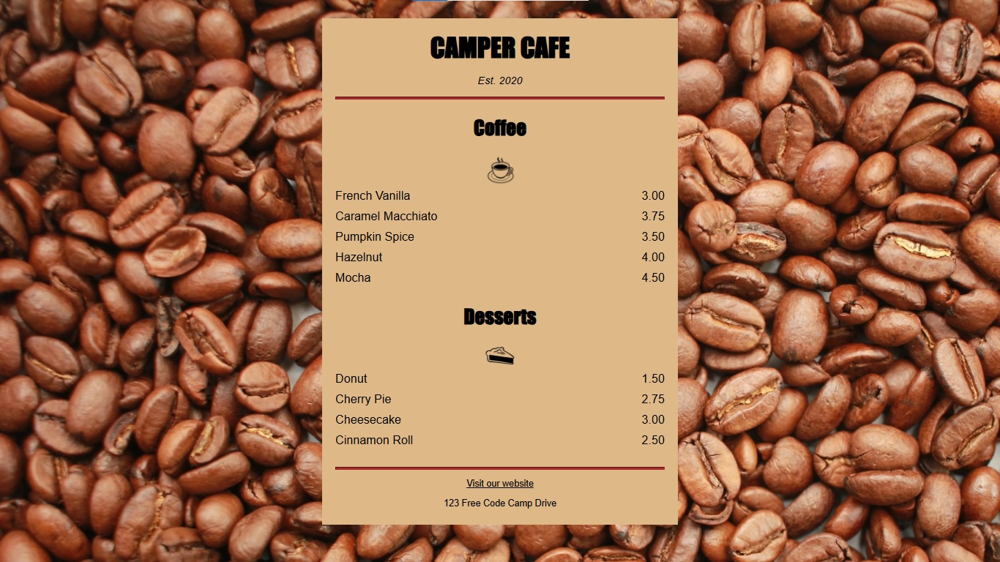

# Menú de Café
> Un ejercicio básico de HTML y CSS que construye una página estilizada de menú para una cafetería ficticia.  
> 📄 [View in English](./README.md)

## Tabla de Contenidos
* [Información General](#información-general)
* [Tecnologías Usadas](#tecnologías-usadas)
* [Características](#características)
* [Capturas de Pantalla](#capturas-de-pantalla)
* [Instalación](#instalación)
* [Uso](#uso)
* [Estado del Proyecto](#estado-del-proyecto)
* [Agradecimientos](#agradecimientos)

## Información General
Este es un proyecto simple de front-end diseñado para practicar el diseño y estilo básico con CSS. La página muestra un menú de café con secciones para bebidas y postres, utilizando prácticas modernas como el contenido centrado, texto estilizado y diseño adaptable.

El proyecto fue realizado como parte del currículo de freeCodeCamp y no está destinado a uso en producción — es principalmente para aprendizaje y seguimiento personal.

## Tecnologías Usadas
- HTML5
- CSS3

## Características
- Diseño adaptable para contenido del menú
- Imagen de fondo personalizada
- Texto estilizado y formato consistente
- Enlace a sitio web externo (freeCodeCamp)
- Efectos hover en enlaces con CSS

## Capturas de Pantalla

### Vista en Escritorio

### Vista en Móvil / Vertical

## Instalación
No requiere instalación. Solo abre el archivo `index.html` en cualquier navegador moderno.

## Uso
Abre el archivo HTML para ver el menú. Utiliza imágenes externas y una hoja de estilo local `styles.css`.

## Estado del Proyecto
El proyecto está: _completo_.

## Agradecimientos
- Este proyecto está basado en el [ejercicio de freeCodeCamp Café Menu](https://www.freecodecamp.org/learn/full-stack-developer/workshop-cafe-menu)
