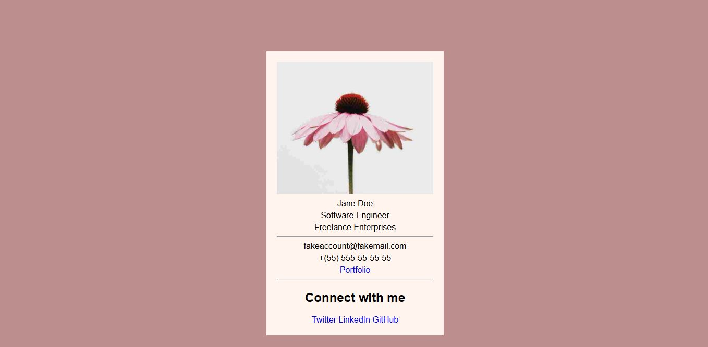

# Business Card Web Page

A simple responsive HTML5/CSS3 business card layout displaying personal and professional details, contact info, and social media links.

## Technologies Used

- **HTML5** – Semantic elements and structure
- **CSS3** – Styling with classes, selectors, hover effects

## Main Features

- Centered digital business card layout
- Responsive profile image
- Custom styling and typography
- Email, phone, and portfolio links
- Social media section with external links

## Setup Instructions

1. Download or clone this repository.
2. Open `index.html` in your web browser.

## How to Use It

- Replace the sample text (name, email, etc.) with your own.
- Update the image and portfolio/social media links as needed.
- Modify styles in `styles.css` to personalize the appearance.

## Project Status

✅ Completed as a learning exercise based on user stories.

## Screenshots

## Acknowledgements

- Based on a [freeCodeCamp exercise](https://www.freecodecamp.org/learn/full-stack-developer/lab-business-card/)
