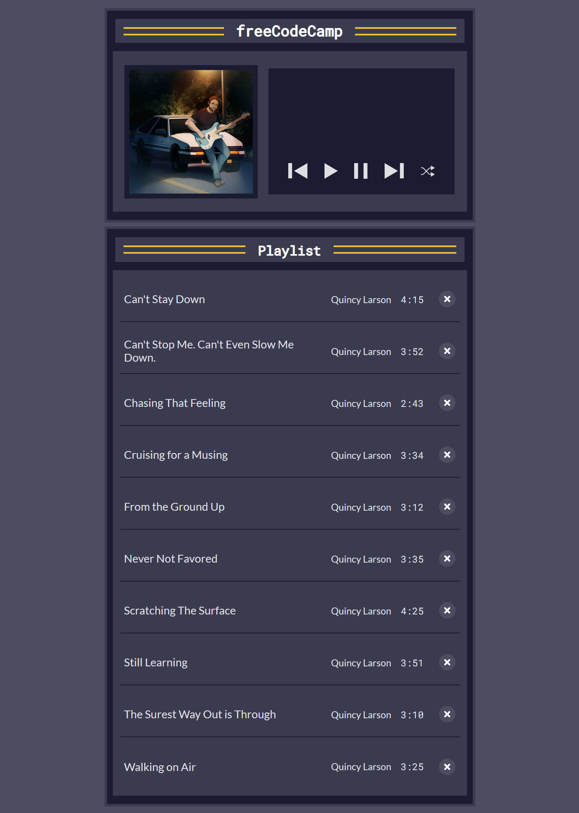
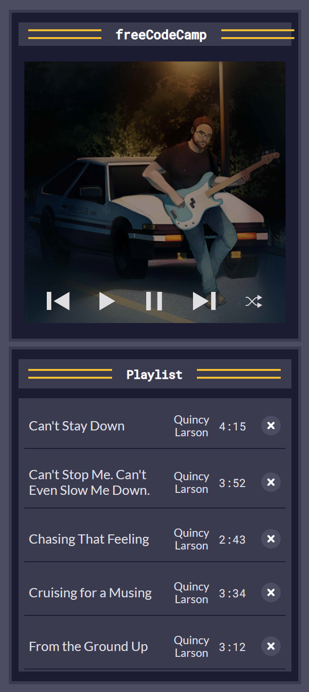
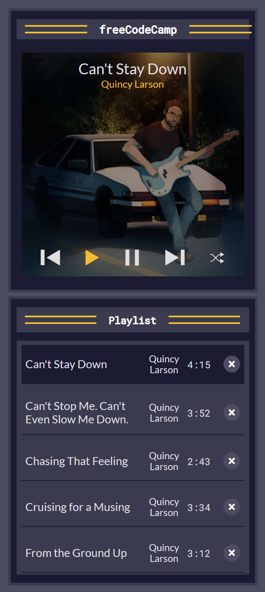

# JavaScript Music Player

A fully functional, responsive music player built with vanilla JavaScript, HTML5, and CSS3. This project was developed as part of freeCodeCamp’s JavaScript curriculum to practice string and array methods while building a real-world application.

The player supports playing, pausing, skipping, shuffling, and deleting songs, along with an accessible UI and dynamic playlist rendering.

---

## Technologies Used

- **JavaScript (ES6+)** – Core logic, DOM manipulation, event handling, and array/string methods  
- **HTML5** – Semantic structure for audio player and playlist  
- **CSS3** – Responsive styling for desktop and mobile layouts, Flexbox, and accessible UI states  

Tested with modern browsers supporting ES6+ (Chrome, Firefox, Edge, Safari).

---

## Main Features

- Dynamic playlist rendering with song titles, artists, and durations  
- Play, pause, next, previous, and shuffle controls  
- Resume playback from the last paused position  
- Highlighting the currently playing song in the playlist  
- Delete songs from the playlist with immediate UI update  
- Reset playlist button appears when all songs are deleted  
- Accessible controls with meaningful ARIA labels for screen readers  
- Responsive design with separate layouts for desktop and mobile  
- Audio events used to auto-play next song and update UI on song end  

---

## Setup Instructions

1. Clone or download this repository to your local machine.  
2. Ensure all files, including `index.html`, CSS, JavaScript, and images, are in the same folder.  
3. Open `index.html` in your preferred web browser to start using the music player.

---

## How to Use

- Click on any song in the playlist to start playing it.  
- Use the play/pause button to control playback.  
- Navigate through songs using next and previous buttons.  
- Shuffle the playlist with the shuffle button.  
- Delete songs with the trash icon next to each song.  
- When the playlist is empty, use the Reset Playlist button to restore all songs.  

---

## Project Status

✅ Completed on **May 2025** as a practical exercise to master JavaScript string and array methods through building an interactive music player.

---

## Screenshots

| Desktop View                                   | Mobile Views                                         |
|------------------------------------------------|------------------------------------------------------|
|     |           |
|   |    |

---

## Exercise Link

Built following the freeCodeCamp exercise:  
[Learn Basic String and Array Methods by Building a Music Player](https://www.freecodecamp.org/learn/javascript-algorithms-and-data-structures-v8/learn-basic-string-and-array-methods-by-building-a-music-player/)

---

## Development Step Guide

| Step Number | Description                                  |
|-------------|----------------------------------------------|
| Step 24     | Use `.join()` so songsHTML is a string, not an array |
| Step 30     | Sort songs alphabetically with `.sort()`     |
| Step 35     | Add functionality to play songs               |
| Step 37     | Find the song by ID                            |
| Step 39     | Resume song from where it stopped             |
| Step 42     | Play button functionality                      |
| Step 47     | Pause button functionality                     |
| Step 51     | Get current song index                         |
| Step 53     | Implement `playNextSong`                       |
| Step 58     | Implement `playPreviousSong`                   |
| Step 61     | Highlight the currently playing song          |
| Step 68     | Display song info in player UI                  |
| Step 74     | Update play button accessible text             |
| Step 78     | Shuffle playlist                               |
| Step 82     | Delete songs from playlist                      |
| Step 88     | Show reset button when playlist is empty       |
| Step 94     | Re-render song list after updates               |
| Step 95     | Auto-play next song when current ends          |

---

## Acknowledgements

- Inspired by and built to complete the freeCodeCamp JavaScript course project on strings and arrays.  
- Thanks to freeCodeCamp for providing detailed curriculum and project guidelines.
