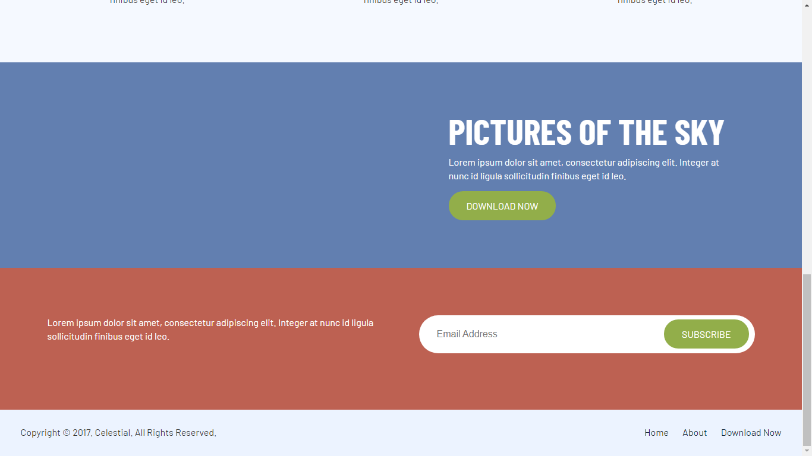

# Look_Up_In_Sky-color_contrast_practice

## General info
The purpose of the project is just personal learning. 

## Description
Color contrast practice. HTML & CSS static webpage of an app webpage - Different CSS pages to change the color palette.

## Screenshots

## Technologies
* HTML5
* CSS3

## Setup
NA - It's only coding examples, there's no setup.

## Status
Project is: _finished_, - kept for future reference.

## References
Based on Codecademy's projects.
