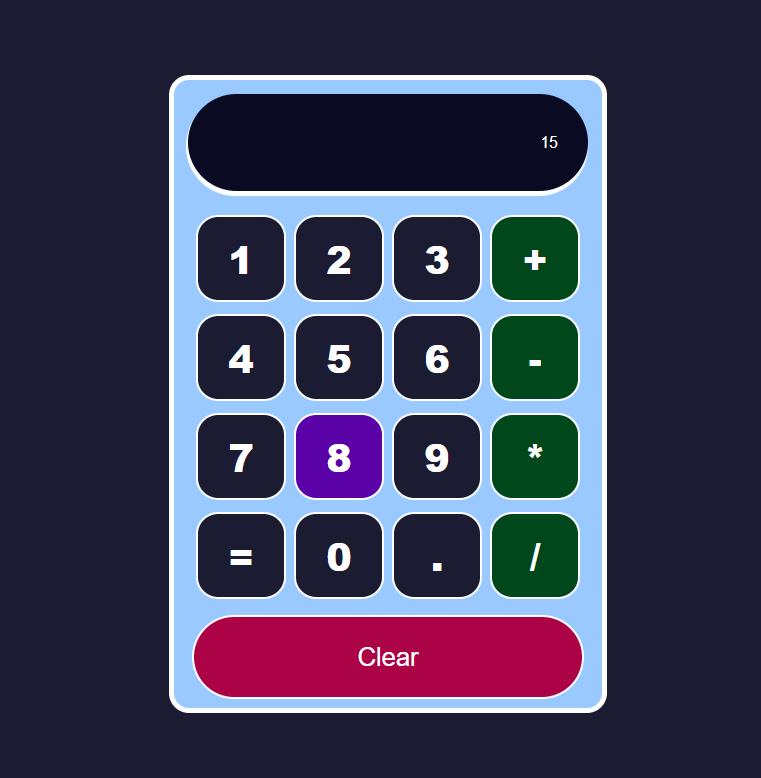
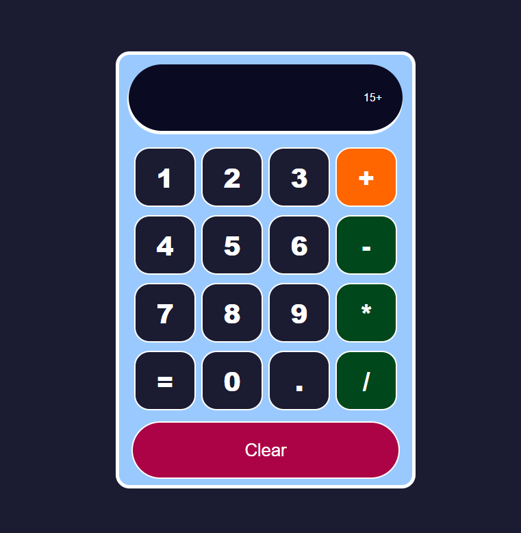
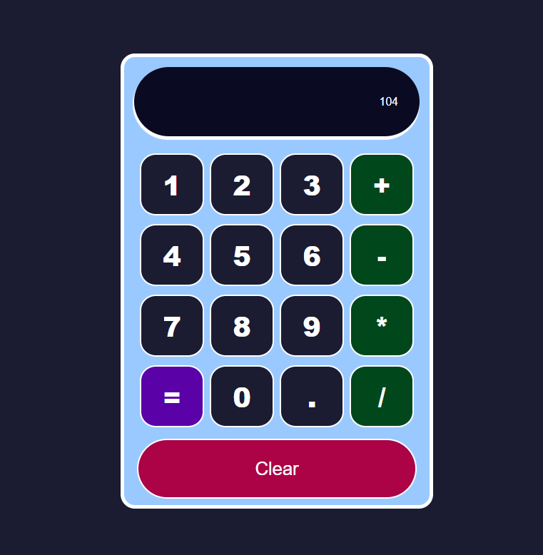

# React Calculator – FreeCodeCamp Project

## Calculator (Legacy)

**⚠️ This project is no longer maintained.  
[A new, modern version is available here](https://github.com/candytale55/calculator-vite)


---

## New Modern Version

Check out the new, modern calculator built with Vite!  
Enjoy faster builds and a streamlined development experience.  
[https://github.com/candytale55/calculator-vite](https://github.com/candytale55/calculator-vite)

---

## About this project

This React application is a functional calculator that supports basic arithmetic operations (addition, subtraction, multiplication, division) using a visually styled keypad and display area. The result is computed using the `mathjs` library.

This project explores more concepts such as conditional rendering, library integration, and component modularity.

While the project includes a mix of styles, syntaxes, and structural decisions, this is intentional — it’s meant to demonstrate different ways of building React components. The variations (like function declarations vs. arrow functions, or passing props vs. using destructuring) reflect real-world flexibility and tutorial pedagogy — **not inconsistency**.

---

## Technologies and Versions

- **React 18.x** — Frontend framework  
- **JavaScript (ES6+)** — JSX, ES6 syntax, arrow functions  
- **CSS3** — Custom styling, visual feedback, layout control  
- **Create React App (CRA)** — Starter boilerplate  
- **mathjs** — Math parser used for evaluating expressions (mathjs@14.5.0)

---

## Features (Things Learned)

- Fully functional calculator using `mathjs.evaluate()`  
- Dynamic string-based input with `useState`  
- Modular components: `Boton`, `BotonClear`, and `Pantalla`  
- Event handling with `onClick` and inline arrow functions  
- Conditional class assignment using `trimEnd()`  
- Custom styles with `user-select: none`, `flex: 1 1`, rounded borders  
- Clean separation between logic and UI  
- Stateless functional components with arrow functions and implicit return  
- Button clear handler: `<BotonClear manejarClear={() => setInput('')} />`  
- Defensive check for empty input in `calcularResultado()` to avoid runtime errors  
- Practical use of `props`, destructuring, and styling best practices  
- Example of styling quirks like `margin: 1px solid #888;`  
- Demonstrates concept of creating a `<Calculadora />` wrapper for centralized logic (alternative approach)

---

## Known Issues / TODOs

- ~~The calculator UI may be **pushed out of the viewport** due to logo positioning and lack of responsive height control~~ (fixed)  
- ~~Clicking the `=` button multiple times after a valid result causes a runtime error from `mathjs`~~ (fixed)  
- ~~Unexpected type of argument in function evaluate (expected: string or Array or Matrix or boolean, actual: number, index: 0)~~ (fixed)
- ~~`evaluate()` expects a string input, but receives a number. Type coercion or guarding logic is required.~~ (fixed)
- ~~Consider modularizing the logic into a dedicated `<Calculadora />` component for improved scalability~~ (The new modern version includes this feature)

---

## Setup and Running

1. Clone the repository:

   ```bash
   git clone https://github.com/estefaniacn/calculadora-react-freecodecamp.git
   ```

2. Navigate into the project directory:

   ```bash
   cd calculadora-react-freecodecamp
   ```

3. Install dependencies:

   ```bash
   npm install
   ```

4. Start the development server:

   ```bash
   npm start
   ```

5. Open [http://localhost:3000](http://localhost:3000) in your browser.

---

## Project Structure Overview

```
/src
├── App.js                 # Main app logic
├── index.js              # Entry point
├── App.css               # App-wide styling
├── /componentes          # Reusable components
│   ├── Boton.jsx
│   ├── BotonClear.jsx
│   └── Pantalla.jsx
├── /hojas-de-estilo      # Component-specific CSS
│   ├── Boton.css
│   ├── BotonClear.css
│   └── Pantalla.css
└── /imagenes             # Logo and screenshots
    ├── freecodecamp-logo.png
    ├── scsh-001.png
    ├── scsh-002.png
    └── scsh-003.png
```

---

## Screenshots

<p align="center">
  
  
  
</p>


---

## Useful Scripts

In the project directory, you can run:

* `npm start` — Run the app in development mode
* `npm run build` — Create an optimized production build
* `npm test` — Run tests (if configured)

More info: [Create React App documentation](https://facebook.github.io/create-react-app/docs/getting-started)

---

## References

* Project 3 from the 2022 React Fundamentals course
* YouTube Tutorial: [https://youtu.be/6Jfk8ic3KVk?si=zydChaDQD2M-UZ-A\&t=13924](https://youtu.be/6Jfk8ic3KVk?si=zydChaDQD2M-UZ-A&t=13924)
* GitHub Repo: [https://github.com/estefaniacn/calculadora-react-freecodecamp](https://github.com/estefaniacn/calculadora-react-freecodecamp)
* mathjs documentation: [https://mathjs.org/docs/index.html](https://mathjs.org/docs/index.html)


