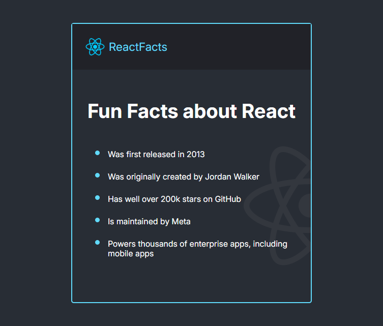

# React Facts – Static React Page 


## 📝 About This Project

This project is a beginner-friendly React application built by following [Bob Ziroll’s Scrimba React Course](https://github.com/scrimba/learn-react). It serves as an introduction to modern React development with Vite, focusing on core fundamentals like component creation, JSX, and styling separation. I followed the YT video instructions and built it in VSC (not in Scrimba).

The app displays fun facts about React using a custom `Header` and a `MainContent` section, demonstrating the use of reusable components and proper structure.

While the app is simple, it lays the groundwork for larger and more interactive React applications, emphasizing best practices, organization, and clean separation between concerns.

---

## 🚀 Technologies and Versions

- **React 18+** – Component-based frontend library  
- **JavaScript (ES6+)** – Modern syntax, modules, JSX  
- **Vite** – Lightning-fast build tool and dev server  
- **CSS3** – Custom styling  
- **Google Fonts** – `Inter` font imported via `fonts.css`

---

## 📚 Concepts Covered

- Functional components using JSX  
- Component composition and modularization (`Header`, `MainContent`)  
- Centralized global styles using `index.css`  
- Font management via local stylesheet (`fonts.css`)  
- Modern React structure with `main.jsx` entry point and `<StrictMode>`  
- Visual grouping using a wrapper component in `App.jsx`  
- Usage of semantic and accessible HTML structure  

---

## ✅ Improvements & Extras

- Removed redundant or default styles added by Vite  
- Centralized font definitions in `fonts.css`  
- Removed unused state hooks from `App.jsx`  
- Consistent use of PascalCase for components and filenames  
- Scoped styles: global styles in `index.css`, local in component files  
- Enhanced layout with an optional border around main content wrapper  
- Ready for scaling into more dynamic React features

---

## 🧭 Project Structure

```

/src
├── App.jsx                  # Root component
├── App.css                  # App-level layout styling
├── main.jsx                 # React entry point
├── index.css                # Global styles (reset, layout, font-family)
├── assets/
│   ├── fonts/
│   │   └── fonts.css        # Font-face declarations for Inter
│   └── images/
│       ├── scsh-01.png      # Project screenshot
│       ├── react-logo.png   # Full React logo
│       └── react-logo-half.png # Half React logo (used in header)
├── components/
│   ├── Header.jsx           # Top navigation bar
│   └── MainContent.jsx      # Fact list and content
└── index.html               # HTML shell with meta and font links

```

---

## 📷 Screenshot

<p align="center">
  
</p>

---

## ⚙️ Setup & Running the Project

1. Navigate to the project folder in your terminal:

   ```
   cd your-project-folder
   ```

2. Install the dependencies:

   ```
   npm install
   ```

3. Start the development server:

   ```
   npm run dev
   ```

4. Open your browser and go to:

   ```
   http://localhost:5173
   ```

That’s it! You should see the React Facts project running locally.


---

## 📺 Tutorial & Credits

* **Course**: [Scrimba – Learn React for Free](https://github.com/scrimba/learn-react)
* **Instructor**: [Bob Ziroll](https://scrimba.com/instructor/bobziroll)
* **Video**: [React Facts Project – YouTube](https://youtu.be/x4rFhThSX04?si=QIQqXsR_Ebc2P6e2&t=6331)

