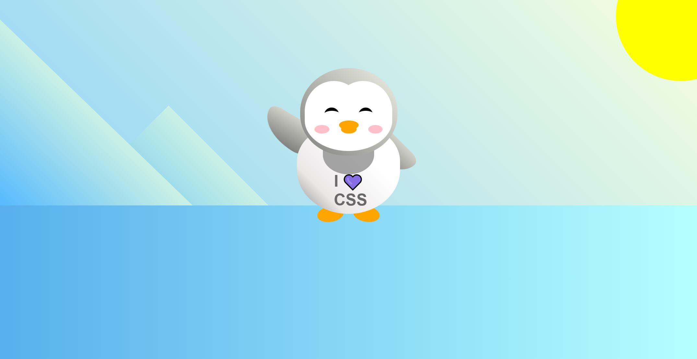

# Penguin Project with HTML & CSS

A creative HTML/CSS project that reconstructs a playful animated penguin scene using modern layout techniques and transform properties. Built as part of the **CSS Transforms** module on freeCodeCamp, this project highlights visual styling, interactivity, and clean component-based design — all without JavaScript.

## Technologies Used

- **HTML5** – Semantic structure and layout composition
- **CSS3** – Transforms, animations, gradients, and responsive design techniques

## Main Features

- Custom penguin design composed entirely of nested `
` elements
- Dynamic interactivity with CSS `:active` and transform-based scaling
- Animated waving arm using keyframe animations
- Responsive sun and mountain background using gradients and positioning
- Clean component structure using CSS variables for easy skin, face, and beak color updates
- Emphasis on positioning, 2D transforms, and `z-index` layering

## Setup Instructions

1. Download or clone this repository.
2. Make sure both `index.html` and `styles.css` are in the same directory.
3. Open `index.html` in your preferred web browser.

## How to Use or Extend

- Modify colors via CSS variables declared in `:root` for easy theme changes.
- Experiment with transform properties such as `rotate`, `scale`, or `skew` to animate different penguin parts.
- Practice responsive design by wrapping or resizing elements to fit various screen widths.
- Extend the project with JavaScript or additional CSS effects for deeper interactivity.

## Project Status

✅ Completed in **May 2025** as part of the [freeCodeCamp "Learn CSS Transforms by Building a Penguin"](https://www.freecodecamp.org/learn/2022/responsive-web-design/learn-css-transforms-by-building-a-penguin/) module.

## Screenshot

## Acknowledgements

- Inspired by [freeCodeCamp’s CSS Transforms Project](https://www.freecodecamp.org/learn/2022/responsive-web-design/learn-css-transforms-by-building-a-penguin/)
- Fonts and emoji used for visual interest and expressive personality

---

> 💡 *This project was designed as both a creative coding challenge and a reference for working with `transform`, `position`, and animation in CSS — all useful in modern UI work.*

