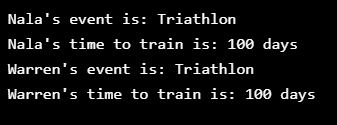

# training_days
JS exercise. Practice of scope (global vs block) in JavaScript. This gives random events (triathlon, marathon, etc) to participants. 

## General info
The purpose of the project is just personal learning. I may revisit this code to find different solutions or to apply it under other context. 

## Description
The problem intro is _"As a seasoned athlete, one of your favorite activities is running marathons. You use a service called Training Days that sends you a message for the event you signed up for and the days you have left to train."_

* getRandEvent() function selects an event at random. 
* getTrainingDays() function returns the number of days to train based on the event selected. 
* The logEvent() and logTime() functions print the athlete name, event, and number of days to the console.

## Screenshots

## Technologies
* Javascript ES6

## Setup
NA - It's only coding examples, there's no setup.

## Status
Project is: _finished_

## References
Based on Codecademy's _Web Development_ path courses, 
