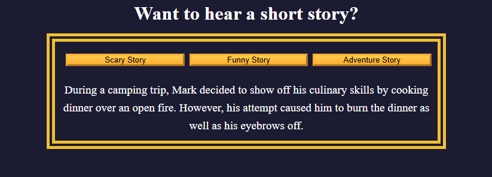

# Storytelling App

A simple interactive storytelling web app that displays different short stories based on user selection. When you click one of the genre buttons (Scary, Funny, Adventure), the app shows a corresponding story and changes the border color of the story container to match the theme.

Built for learning purposes.

---

## Features

- Display short stories for three genres: Scary, Funny, and Adventure.
- Dynamic border color change based on selected story genre.
- Responsive button layout (column on small screens, row on larger screens).
- Clean and simple user interface.

---

## Technologies Used

- **HTML5** — Structure and content of the webpage.
- **CSS3** — Styling, layout, and responsive design.
- **JavaScript (ES6)** — DOM manipulation, event handling, and dynamic content update.

---

## Screenshot

## How to Run

1. Download the files.
2. Open `index.html` in a modern web browser.
3. Click any story button to see the story and border color update.

## Date of Completion

June 7, 2025

