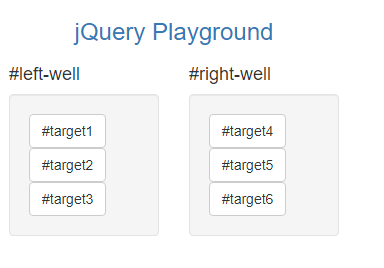

# jQuery_playground

## General info
The purpose of the project is just personal learning. 

## Description
A simple grid (two wells and 6 targets) to practice Bootstrap. A section with notes on Bootstrap and Favicon. To tell you the truth I don't remember what does jQuery had to do with this grid.

## Screenshots

## Technologies
* Bootstrap
* HTML5
* CSS3

## Setup
NA - It's only a coding exercise, there's no setup.

## Status
Project is: _finished_, - kept for future reference.

## Personal notes: 

Notes:
                         Bootstrap Classes
Most of Bootstrap's classes can be applied to a div element.

TEXT
---------------
text-primary  (color blue)
text-center
red-text

GRID
---------------
container-fluid
row
col-xs-6

form-control
elements with the class .form-control have a width of 100%.

Now let's get your form input and your submission button on the same line. We'll do this the same way we have previously: by using a div element with the class row, and other div elements within it using the col-xs-* class.

Bootstrap uses a responsive 12-column grid system, to put elements into rows and
specify each element's relative width.
Bootstrap has different column width attributes that it uses depending on
how wide the user's screen is.
Bootstrap's col-md-* class. (md means medium) and * is a number specifying
how many columns wide the element should be.
In this case, the column width of an element on a medium-sized screen, such as a laptop, is being specified.
col-xs-*, (xs means extra small, like an extra-small mobile phone screen).

 on form elements, too! Radio buttons will be evenly spread out across the page,
 regardless of how wide the screen resolution is.

well  (creates a visual sense of depth)
span

Use spans to create inline elements.
That illustrates the difference between an "inline" element and a "block" element.
By using the inline span element, you can put several elements on the same line,
even style different parts of the same line differently giving classes,
for example class text-danger to make the text red.

BUTTONS
--------
btn
btn-default
btn-primary (blue)
btn-info
btn-danger
btn-block
target
fa-paper-plane

button elements with the btn and btn-default classes are only as wide as the text that they contain.
By making them block elements with the additional class of btn-block, they stretch to fill your page's entire horizontal space and any elements following it will flow onto a "new line" below the block.

Bootstrap comes with several pre-defined colors for buttons. The btn-info class is used to call attention to optional actions that the user can take.

The btn-danger class is the button color you'll use to notify users that the button performs a destructive action, such as deleting a cat photo.

IMAGES
------

img-responsive

ICONS
----------
fa
fa-info-circle
fa-thumbs-up
info-circle
trash

   <!--Font Awesome is a library of icons (vector graphics, .svg file format).
   These are treated just like fonts, you can specify size using pixels,
   and they will assume the font size of their parent HTML elements.-->

   The i element was originally used to make other elements italic,
   but is now commonly used for icons.
   You can add the Font Awesome classes to the i or span elements.

   <i class="fa fa-info-circle"></i>
