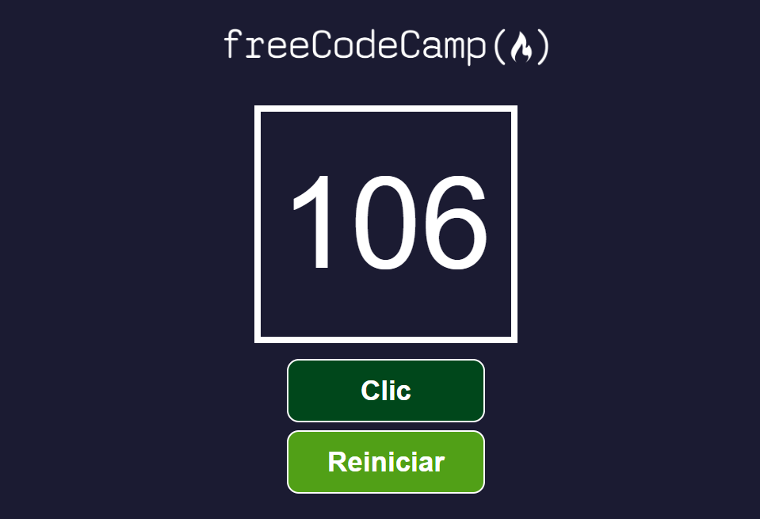

# Contador de Clics – React Project (Class Components Version)

> Proyecto 2 (Clase) from the 2022 React Fundamentals course  
> Finished: **May 2025**  
> Tutorial: https://youtu.be/6Jfk8ic3KVk?si=NZyzVRJKZ0lfbVvx&t=27757

---

## About this project

This React application implements a simple click counter using **class-based components**. It is a reworked version of the functional project from the freeCodeCamp React Fundamentals course on YouTube. The interface includes two buttons — one to increment the click count and another to reset it — along with a live counter.

Unlike the original version that used **functional components** with `useState`, this project refactors `App`, `Contador`, and `Boton` into **class components**, providing a hands-on look at traditional React practices such as using constructors, managing state with `this.state`, and event handling via class methods or arrow functions.

In the `App` component, both **a class method** and **an arrow function** are used to handle events, illustrating two valid approaches to `this` binding in class components. Props are passed using **destructuring** for cleaner syntax. A modular `Logo` component was also added for better structure.

The app is styled with component-based CSS and designed to work across screen sizes.

---

## Learning Highlights

This project was built as a hands-on way to explore React **class components**, which are the predecessor to functional components with hooks. While modern React often prefers functions with `useState` and `useEffect`, understanding class-based components remains valuable for:

- Reading and maintaining legacy codebases
- Learning how `this.state`, `constructor`, and `setState()` work
- Handling event binding with `this` and understanding scope
- Comparing approaches: **arrow functions** vs. **bound methods** in event handlers
- Reinforcing key React concepts like **props**, **state**, and **component hierarchy**

By converting all major components from functional to class-based and mixing both binding methods (`bind()` and arrow functions), this project serves as a complete beginner-friendly example of class components in practice.

---

## Technologies and Versions

- **React 18.x** — Frontend framework  
- **JavaScript (ES6+)** — JSX, class syntax, destructuring  
- **CSS3** — Modular styling and layout  
- **Create React App (CRA)** — Project scaffolding (`npx create-react-app [folder-name]`)

---

## Features

- Class-based component structure (`App`, `Contador`, `Boton`)  
- State managed via `this.state` and updated with `this.setState`  
- Event handlers:
  - `manejarClic`: implemented as an **arrow function** (auto-binds `this`)
  - `reiniciarContador`: implemented as a **method** with manual `bind()` in constructor  
- Props destructured in components for clarity  
- Semantic HTML and accessibility best practices  
- Modular `Logo` component  
- Organized file structure and modular CSS

---

## Setup and Running

1. Clone the repository:  
   ```
   git clone https://github.com/your-username/contador-de-clics-clase.git
   ```

2. Navigate into the project folder:

   ```
   cd contador-de-clics-clase
   ```

3. Install dependencies:

   ```
   npm install
   ```

4. Start the development server:

   ```
   npm start
   ```

5. Open [http://localhost:3000](http://localhost:3000) in your browser.

---

## Project Structure Overview

```
/src
├── App.js                    # Main application (class component)
├── index.js                  # Entry point
├── /componentes
│   ├── Boton.jsx             # Button (class component)
│   ├── Contador.jsx          # Counter (class component)
│   └── Logo.jsx              # Reusable logo component
├── /imagenes                 # Static images and screenshots
└── /hojas-de-estilo          # CSS modules for each component
```

---

## Useful Scripts

In the project directory, you can run:

* `npm start` — Launches development server
* `npm run build` — Builds app for production
* `npm test` — Runs tests
* `npm run eject` — Ejects from CRA config (advanced use)

More info: [Create React App documentation](https://facebook.github.io/create-react-app/docs/getting-started)

---

## Screenshots

<table>
  <tr>
    <td></td>
    <td></td>
  </tr>
  <tr>
    <td></td>
    <td></td>
  </tr>
</table>

---

## References

* YouTube tutorial (class-based version):  
  [https://youtu.be/6Jfk8ic3KVk?si=NZyzVRJKZ0lfbVvx&t=27757](https://youtu.be/6Jfk8ic3KVk?si=NZyzVRJKZ0lfbVvx&t=27757)

* GitHub repository for Proyecto 2 (Clase):  
  [https://github.com/estefaniacn/contador-de-clics-clase](https://github.com/estefaniacn/contador-de-clics-clase)

* Original functional version:  
  [https://github.com/estefaniacn/contador-de-clics-freecodecamp](https://github.com/estefaniacn/contador-de-clics-freecodecamp)

* **Note to self:** Scaffolded with `npx create-react-app` per tutorial.

---

## Acknowledgements

* Built while following the freeCodeCamp React Fundamentals curriculum  
* Thanks to freeCodeCamp and Estefanía C.N. for providing clear, hands-on learning material
