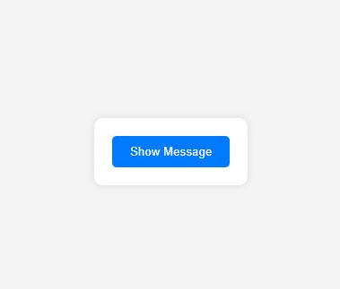
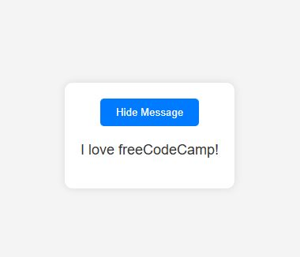

# Toggle Text Visibility App

A simple React-based app that toggles the visibility of a message using the `useState` hook. Built as part of [freeCodeCamp's Toggle Text App Workshop](https://www.freecodecamp.org/learn/full-stack-developer/workshop-toggle-text-app/step-1), this exercise focuses on managing UI state in a functional React component.

---

## Project Status

**Completed: June 2025**  
This project was created as a hands-on activity to reinforce foundational knowledge of React’s `useState` hook for toggling UI elements.

---

## Technologies Used

- **React (v18+)** – Functional components with hooks  
- **HTML5** – Basic semantic structure  
- **CSS3** – Centered layout, styled button, simple card UI  
- **Babel** – Inline JSX transformation for direct browser execution  

> Tested in Chrome

---

## Features

- Toggle a message on/off with a button click  
- Button label changes based on visibility state  
- Clean and centered card layout  
- Smooth visual transition using CSS hover effects

---

## Setup Instructions

1. Copy this project folder into your local tutorials archive repository.
2. Open the `index.html` file in your browser:

   ```
   open index.html
   ```

> No build tools or servers required — runs directly in the browser via CDN and Babel.

---

## Project Structure

```
.
├── index.html          # HTML entry point
├── index.jsx           # React component using useState
├── styles.css          # App styling
├── scsh-01.JPG         # Screenshot: Message hidden
└── scsh-02.JPG         # Screenshot: Message visible
```

---

## Screenshots

**Message Hidden:**



**Message Visible:**



---

## Key React Concepts Used

| Concept        | Description                                            |
| -------------- | ------------------------------------------------------ |
| `useState()`   | Stores and updates the visibility state of the message |
| Event handling | Handles button click to toggle the state               |
| JSX            | Conditionally renders elements based on state          |

---

## Educational Purpose

This project was designed to help React beginners:

* Understand how component state is initialized and updated
* Learn conditional rendering in JSX
* Practice functional components and event handling

---

## Acknowledgements

* Built as part of [freeCodeCamp's Full Stack Developer Workshop](https://www.freecodecamp.org/learn/full-stack-developer/workshop-toggle-text-app/step-1)
* Thanks to the open-source contributors behind freeCodeCamp

