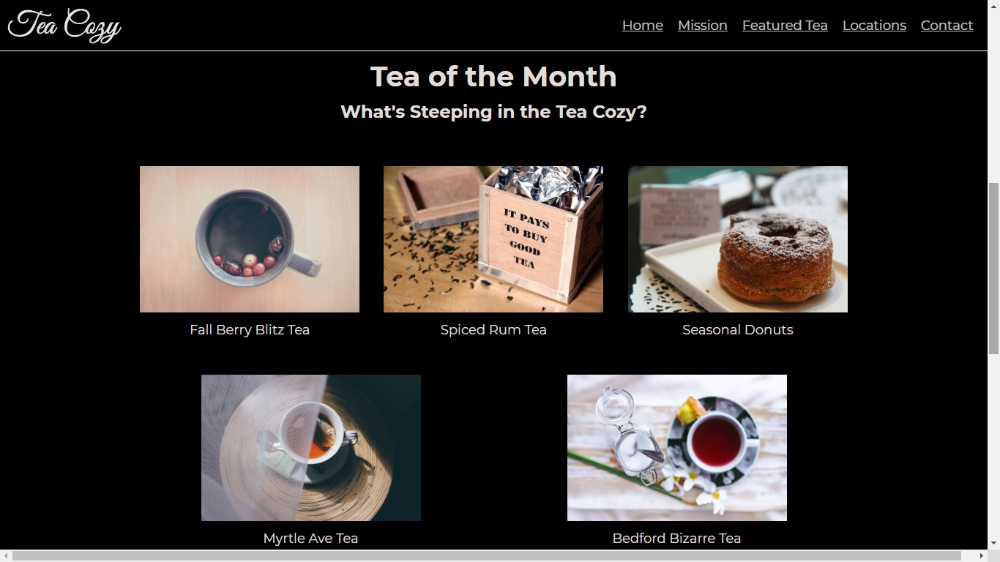

# tea_cozy
 

## Description
Static HTML & CSS page - Fake tea shop website

#### To-do list:
* Needs media queries.

## Table of contents
* [Description](#description)
* [Screenshots](#screenshots)
* [Technologies](#technologies)
* [Setup](#setup)
* [Status](#status)
* [References](#references)

## Screenshots

## Technologies
* HTML5
* CSS3

## Setup
It's only a static page, there's no setup.

## Status
Project is: _finished_ - kept for reference.

## References
Based on Codecademy's _Web Development_ path exercise (2019)
