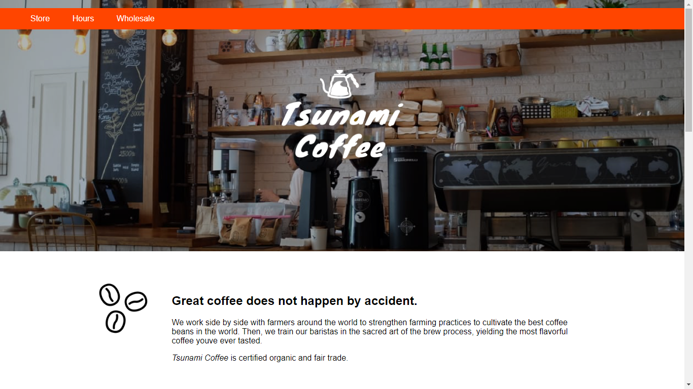
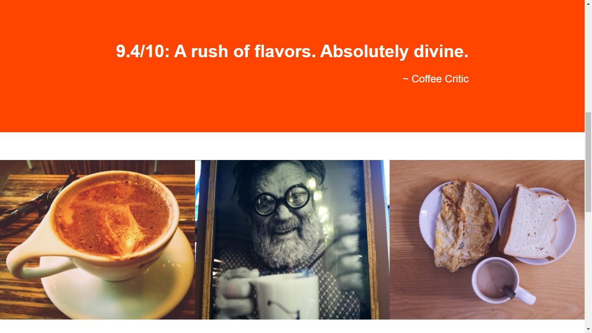
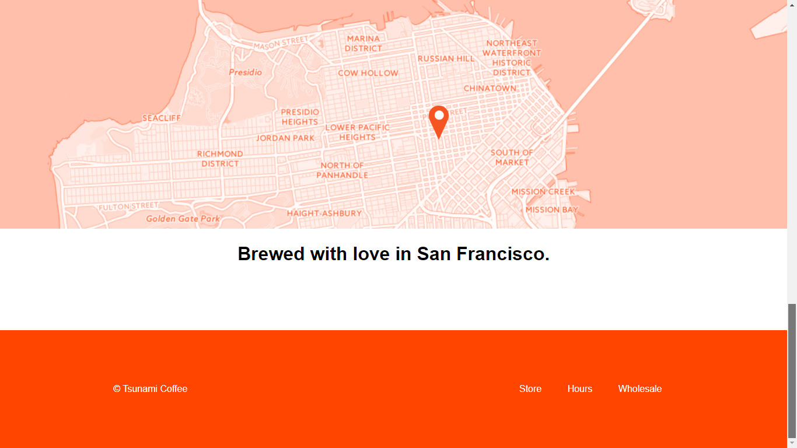

# tsunami_coffee

> Static CSS & HTML Codecademy exercise . The purpose of this project is to edit an existing Tsunami Coffee website code using relative units and responsive web design so that the website appears correctly on varying screen sizes.

## General info
The purpose of this project is to edit an existing _Tsunami Coffee_ website code using relative units and responsive web design so that the website appears correctly on varying screen sizes. 

## Features
List of features ready:

The **_.container_** class limits the with of the sections to a specific widht (making them not as wide as the screen)

**_.main section_** displays a background image in the main section at the top of the page, with the _Tsunami Coffee_ logo in the middle and contains the navigation menu (_Store, Hours, Wholesale_).

Followed by 4 div sections (_.supporting_, _.rating_, _.gallery_, _.location_)

**_.supporting_**: includes an image of three beans to the left and a description of the company set in a div with class _.description_ to the right.

**_.rating_**: includes a _critique_ and rating by a _"Coffee critic"_. in a _div.container_

**_.gallery_**: contains three images, they are set to show the three in the same line. 

**_.location_**: contains a map and a legend _"Brewed with love in ..."_ 

**_footer_**: Includes a copyright and the navigation menu at the bottom of the page. 

### To-do list for future development
* Add link interaction (hover, active, etc.)
* Fix those media queries for gallery in smaller sizes.
* Maybe add menu items. 
* The footer is too high. 

## Table of contents
* [General info](#general-info)
* [Features](#features)
* [Screenshots](#screenshots)
* [Technologies](#technologies)
* [Setup](#setup)
* [Status](#status)
* [References](#references)
* [Credits](#credits)

## Screenshots

### Historic: 

## Technologies
* HTML 5
* CSS 3

## Setup
na

## Code Examples
`na`

## Status
Project is: _in progress_

## References
This project uses clearfix which I don't yet understand completely. For reference:

https://www.w3schools.com/howto/howto_css_clearfix.asp

https://www.w3schools.com/css/css_float_clear.asp

## Credits

Project based on _Codecademy_ course _Learn Responsive Design_ here: https://www.codecademy.com/learn/learn-responsive-design

Used reset.css from https://github.com/necolas/normalize.css 
