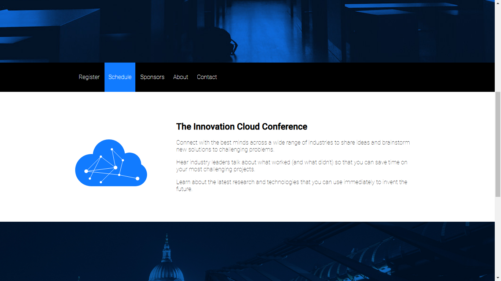

# innovation_cloud
> Innovation conference HTML5 & CSS3 landing page. Codecademy project for studying CSS anatomy. Uses media queries and changes in color with transition on :hover elements

## General info
The purpose of the project is just personal learning. 

## Screenshots

## Technologies
* HTML5
* CSS3

## Setup
NA - Static page

## Status
Project is: _finished_, - kept for future reference.

## References
Based on Codecademy's _Learn CSS_ course exercises.
