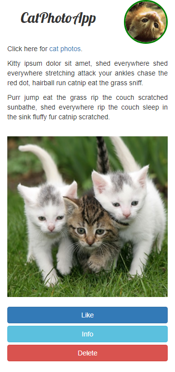

# cat_photo_app_FCC
freeCodeCamp HTML5 & CSS3 exercise. - A silly mobile app dedicated to cute cats.

## General info
The purpose of the project was just personal learning.

## Screenshots

## Technologies
* HTML5
* CSS3

## Setup
NA 

## Status
Project is: _finished_, - kept for reference.

## References
Based on FreeCodeCamp's excercises (2019). 
