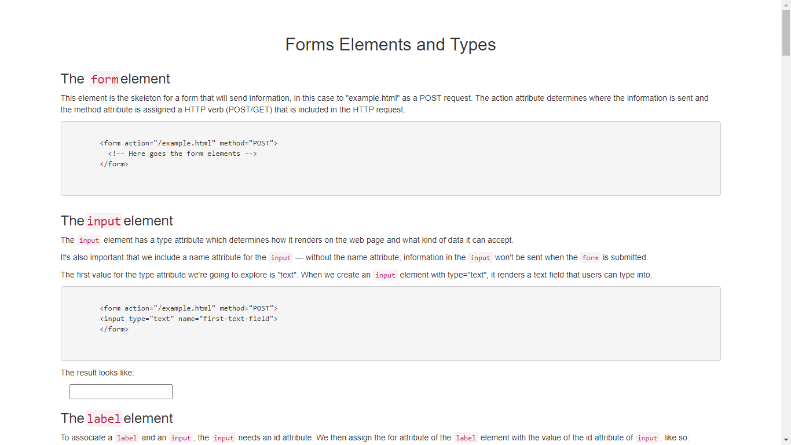

# form_elements_template

## Description
An HTML, Bootstrap & CSS3 document with code examples for working with HTML form elements. It should've been a project but I don't remember for what.

#### To-do list:
* Fix the spans of the range ends on the range section so that they appears in the conrners.

## Screenshots

## Technologies
* Bootstrap
* HTML5
* CSS3

## Setup
NA - It's only a coding exercise, there's no setup.

## Status
Project is:  _finished_, - kept for future reference.
