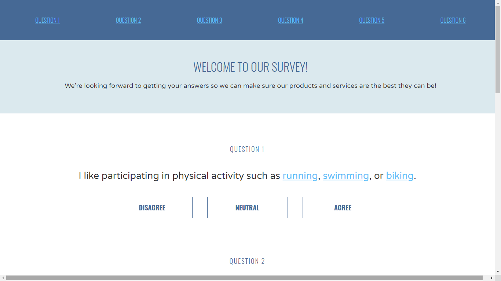

# Survey_Question_Buttons
Fake survey website coding exercise. Only a static webpage, no real survey-taking code in place. _"We're looking forward to getting your answers so we can make sure our products and services are the best they can be!"_

## General info
The purpose of the project is just personal learning.  

#### To-do list:
* Add media queries so that it displays for mobile and other smaller devices.
* Add functionality to actually take a survey. 

## Screenshots

#### Historic

## Technologies
* HTML5
* CSS3

## Setup
NA - It's only a coding exercise, there's no setup.

## Status
Project is:  _finished_, - kept for reference.

## References
Based on Codecademy's _Learn Navigation Design_ course
