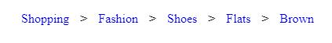

# Simple-Example-of-Breadcrumbs
Breadcrumbs are usually displayed as a horizontal list of pages and take up minimal space. Users expect to find them in the header, left-aligned, and below any primary navigation. Typically they are separated with a “>” or a “/“ symbol.

## Description
* Breadcrumbs should display on the same line, next to each other : **_display inline_** for the **_.breadcrumb > li_** selector.
* In order to have breadcrumbs separated by a symbol (for example ">" or "/"), and to avoid having to manually add the symbol in the breadcrumb trail: using the **_.breadcrumb li+li::before_** pseudo-selector with **_content_** property set to **_“>”_** to place the greater than sign between each adjacent breadcrumb.
* Breadcrumbs shouldn't be underlined = **_text-decoration_** property of selector **_.breadcrumb a_** to value **_none_**. Underlines communicate that text within paragraph elements can be clicked, but we want that users recognize breadcrumbs as part of the site navigation instead of other clickable text.
* Breadcrumbs should change when you hover over them = **_.breadcrumb a:hover_** selector is set to have the **_color: red_** and/or to **_text-decoration_** set to **_underline_**

***Example:** Three html files that simulates asimple breadcrumb structure. The other pages are within the same directory as brownshoes.html and they link to : 
shoes -> shoes.html
flats -> flats.html
brown -> leave this as '#' since we are already on that page 
The shoes.html page is the starting breadcrumb, so this page will only have one breadcrumb that links to itself ('#'). This may not look useful but it keeps consistency.

## Screenshots

## Languages
* HTML5
* CSS3

## Setup
NA - It's only coding examples, there's no setup.

## Status
Project is:  _finished_, - Kept as reference.

## References
Based on Codecademy's _Learn Navigation Design_ course
