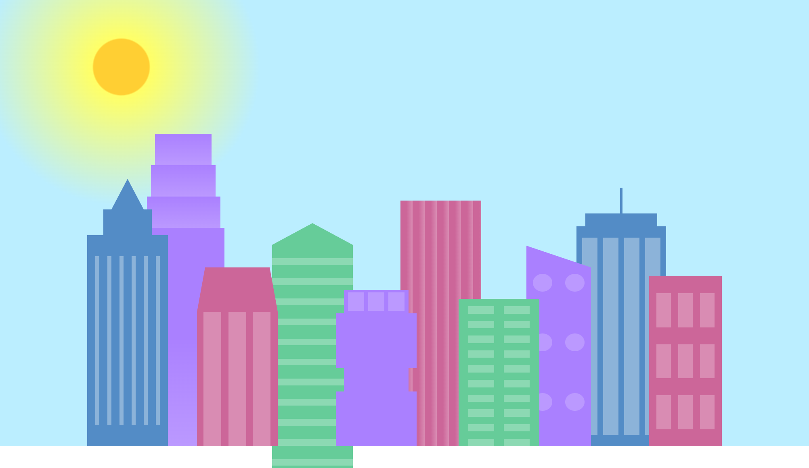
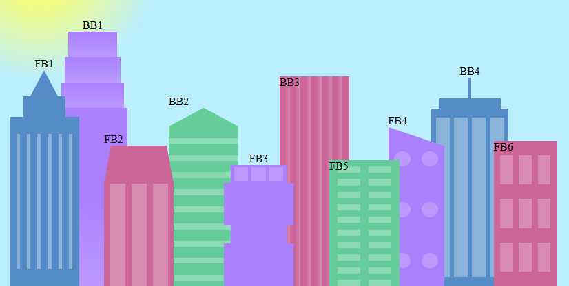

# 🌆 City Skyline with Responsive CSS Variables

A responsive HTML/CSS project that recreates a stylized city skyline using **CSS variables** and **layout techniques**. This exercise focuses on using custom properties for styling consistency and `@media` queries for a **day-to-night transition** based on screen width.

Built as part of [freeCodeCamp’s CSS Variables Project](https://www.freecodecamp.org/learn/2022/responsive-web-design/learn-css-variables-by-building-a-city-skyline/), this layout explores radial and linear gradients, border-based shapes, and responsive themes.

---

## 🛠 Technologies Used

- **HTML5** – Semantic layout and building structure
- **CSS3** – Custom properties (CSS variables), gradients, borders, flexbox, media queries

---

## ✨ Main Features

- Uses **CSS Variables** for reusable building and window color themes
- Implements **gradients** for complex textures and skies (smooth and hard stops)
- Creates **triangles and custom shapes** using `border` techniques
- Responsive layout: switches from **day scene to night scene** using `@media (max-width: 1000px)`
- Applies **flexbox** to organize buildings side by side and align them at the bottom
- Uses **radial gradients** to simulate sunlight and sky transitions
- Fully semantic layout with layered `div` structures for visual clarity

---

## ⚙️ Setup Instructions

1. Download or clone this repository.
2. Ensure both `index.html` and `styles.css` are in the same directory.
3. Open `index.html` in your browser to view the skyline.

---

## 🧪 How to Use It

- Resize the browser window to under `1000px` width to see the **"night mode"** automatically activate via media queries.
- Experiment with CSS variables in the `:root` to change building themes or create new color sets.
- Use this layout to practice **gradients**, **border-based shapes**, and **responsive color transitions**.

---

## ✅ Project Status

Project is complete — created as a **layout, gradients, and responsive styling** exercise using CSS Variables.

---

## 📸 Screenshots

| Day Theme (Over 1000px) | Night Theme (Under 1000px) |
|-------------------------|----------------------------|
|  |  |

---

## 🔗 Other References

📘 **Notes:** [Notes for Building a City Skyline](https://github.com/candytale55/FCC-Code-Basics-Notes/blob/master/2025/Responsive-Design/building-a-city-skyline-with-CSS/img/Notes-for-Building-a-City-Skyline-with-CSS.md)  
🧾 **CSS Cheatsheet:** [CSS Variables / Custom Properties Cheatsheet](https://github.com/candytale55/my-snippets/blob/main/MD-Notes/CSS-Variables-Custom-Properties-Cheatsheet.md)

### 🧱 Building Guide

---

## ℹ️ Acknowledgements

Inspired by [freeCodeCamp’s Responsive Web Design Project](https://www.freecodecamp.org/learn/2022/responsive-web-design/learn-css-variables-by-building-a-city-skyline/) — focused on mastering **CSS Variables** and applying them in a responsive visual layout.

### 📘 Quick Reference Steps

| Step | Description |
|------|-------------|
| 10–13 | `.bb1` – Base building stack |
| 20 | Flexbox for `.background-buildings` |
| 25 | `:root` selector for variables |
| 28 | `.fb1` – Foreground building setup |
| 44 | `.bb1d` – Multicolor linear gradient |
| 46 | Smooth gradient stops |
| 51 | Hard stops for the gradient sky |
| 52 | `repeating-linear-gradient` – Horizontal stripes |
| 54–58 | `.bb2a` – Triangle top building |
| 60 | `.bb3` – Vertical window stripes |
| 63 | `.bb4` – Complex building with nested layers |
| 70–71 | `.window-wrap` and `.bb4-window` |
| 73 | `.fb1` – Foreground building with top triangle |
| 77–78 | `.fb1c` – Vertical windows using two gradients |
| 79 | `.fb1a` – Triangle top using `border-bottom` |
| 85 | `.fb2-window` styling |
| 87 | `.fb2a` – Triangle using border-bottom |
| 89–90 | `.fb3` and window layout |
| 93–94 | `.fb3-window` and triple layout |
| 97 | `.fb4` – Right-most purple building |
| 100 | `.fb4-window` – Circular windows |
| 102 | `flex-wrap` to align `.fb4` windows |
| 103 | `.fb4a` – Half triangle on top using borders |
| 104–105 | `.fb5` window layout using double gradients |
| 107 | `.fb6` – Vertical windows and building base |
| 112 | `.sky` – `radial-gradient` with `circle closest-corner` |
| 114 | `@media` query to activate night mode |
