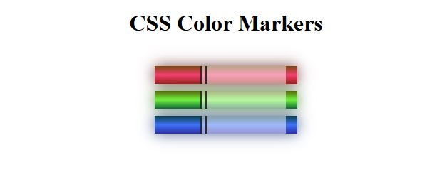

# Color Markers Web Page

A simple and colorful HTML5/CSS3 layout demonstrating custom marker elements using gradients, shadows, and color systems like RGB, RGBA, HSL, and HSLA.

## Technologies Used

- **HTML5** – Semantic structure for content organization
- **CSS3** – Styling with gradients, box shadows, color systems, and inline-block layout

## Main Features

- Stylized marker components with cap and sleeve elements
- Use of multiple color formats (RGB, RGBA, HSL, HSLA)
- Visual effects with gradients and shadows
- Clean layout using block and inline-block display techniques
- Centered layout with auto margins and padding

## Setup Instructions

1. Download or clone this repository.
2. Open `index.html` in your web browser.

## How to Use It

- Review the use of various CSS color formats for styling.
- Modify the color values to experiment with different looks.
- Use the layout structure to build your own styled components.

## Project Status

✅ Completed as part of a FreeCodeCamp learning exercise.

## Screenshots

## Acknowledgements

- Based on [FreeCodeCamp's CSS Color Markers Project](https://www.freecodecamp.org/learn/2022/responsive-web-design/learn-css-colors-by-building-a-set-of-colored-markers/)

