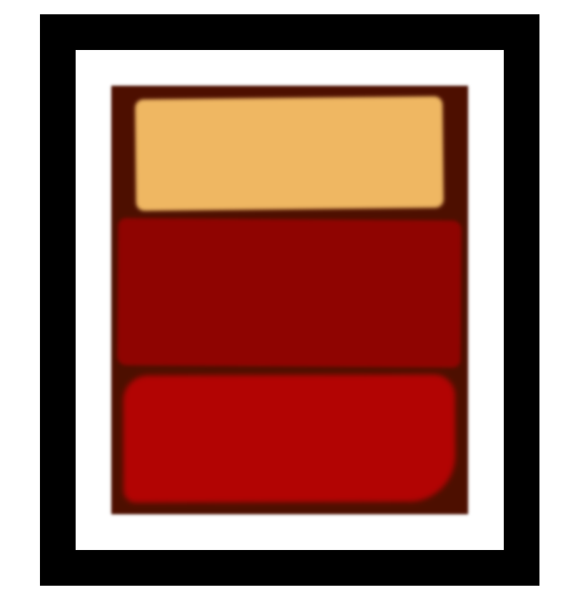

# Rothko Painting with CSS

A minimalist HTML/CSS project that reproduces a Rothko-style painting using the CSS Box Model. This exercise demonstrates the use of content, padding, border, and margin to control layout and design — mimicking abstract art with just `div` elements.

## Technologies Used

- **HTML5** – Semantic structure for layout
- **CSS3** – Box Model, filters, shadows, and transformations

## Main Features

- Uses the full CSS Box Model: margin, border, padding, and content
- Abstract art inspired by Mark Rothko
- Soft blurred effects and shadows for visual depth
- Creative use of gradients, border radius, and transforms
- Responsive centering with auto margins

## Setup Instructions

1. Download or clone this repository.
2. Ensure both `index.html` and `styles.css` are in the same directory.
3. Open `index.html` in your web browser.

## How to Use It

- Experiment with box model properties (e.g., margins, padding, borders).
- Try changing the colors, border radius, or dimensions to create your own style.
- Use this as a visual tool to understand how nested divs and layout spacing work.

## Project Status

✅ Completed as a learning exercise based on the Box Model lesson.

## Screenshots

## Acknowledgements

- Inspired by [freeCodeCamp’s Box Model Project](https://www.freecodecamp.org/learn/2022/responsive-web-design/learn-the-css-box-model-by-building-a-rothko-painting/)
