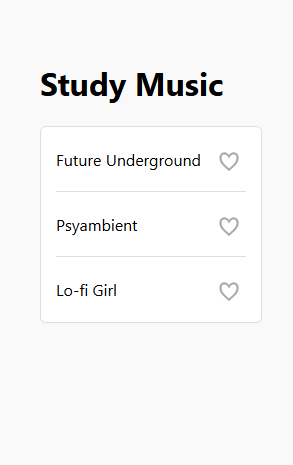

# Favorite Icon Toggler

A minimalist music genre list app built with **vanilla JavaScript**, **HTML5**, and **CSS3**.

This interactive project allows users to click heart icons next to music genres to mark them as favorites. When clicked, each heart toggles between an empty and a filled state using JavaScript class manipulation and Unicode symbols.

This project was developed as part of [freeCodeCamp’s Favorite Icon Toggler Lab](https://www.freecodecamp.org/learn/full-stack-developer/lab-favorite-icon-toggler/build-a-favorite-icon-toggler), focusing on hands-on experience with event handling, class manipulation, and updating the DOM with JavaScript.

---

## Project Status

**Completed: June 2025**  
This project was created as a practice exercise to demonstrate how to toggle icons using click events and DOM class manipulation in vanilla JavaScript.

---

## Technologies Used

- **JavaScript (ES6+)** – Handles event listeners, DOM querying, and content updates  
- **HTML5** – Provides semantic structure for the list and button icons  
- **CSS3** – Manages layout, visual feedback, and transition effects

> Tested in Chrome.

---

## Features

- A list of three music genres  
- Each item has a heart icon (♡) to mark it as a favorite  
- Clicking the heart toggles it to a filled version (❤), and back again  
- Smooth scaling animation on hover  
- Filled hearts appear in crimson for visual distinction

---

## Setup Instructions

1. Copy or download this specific project folder from your tutorials repository.  
   You can either:
   - Download the entire repository as a ZIP and extract this project folder (not recommended), or  
   - Navigate to the project folder in GitHub and download files individually.

2. Open the `index.html` file in your browser:

   ```bash
   open index.html
   ```

> No server, build tools, or dependencies are required.

---

## Project Structure

```
favorite-icon-toggler/
├── index.html          # Core HTML markup
├── styles.css          # Styling for layout and interaction
├── script.js           # JavaScript logic for toggling icons
└── img/                # Screenshots
    ├── screenshot-01.png
    ├── screenshot-02.png
    └── screenshot-03.png
```

---

## Screenshots

| Initial View                      | After Clicking a Heart                 | Hover Effect                    |
| --------------------------------- | -------------------------------------- | ------------------------------- |
|  |  |  |

---

## Key JavaScript Concepts Used

| Concept              | Description                                                       |
| -------------------- | ----------------------------------------------------------------- |
| `querySelectorAll()` | Selects all heart buttons to attach event listeners               |
| `addEventListener()` | Listens for click events to toggle the heart icon                 |
| `classList.toggle()` | Adds or removes the `filled` class to change heart appearance     |
| `innerHTML`          | Changes the symbol from empty heart (♡) to filled heart (❤)       |
| Conditional logic    | Checks whether the icon is already filled and updates accordingly |

---

## ⚠️ Security Note on `innerHTML`

> This project uses `innerHTML` to switch between Unicode heart icons (`♡` and `❤`).
> While safe in this controlled, static use case, be cautious in production environments where user-generated or untrusted content is involved — using `innerHTML` can expose your application to **cross-site scripting (XSS)** attacks.

Prefer safer alternatives like `textContent` or direct DOM manipulation (e.g., `createElement`) when rendering dynamic content.

---

## Educational Purpose

This project is part of freeCodeCamp’s full stack curriculum and is ideal for beginners looking to:

* Practice JavaScript event handling and DOM manipulation
* Learn how to use classes to control styling
* Improve their understanding of interactive UI behavior using native web APIs
* Build lightweight, framework-free interfaces

---

## Acknowledgements

* Built for [freeCodeCamp's Favorite Icon Toggler Lab](https://www.freecodecamp.org/learn/full-stack-developer/lab-favorite-icon-toggler/build-a-favorite-icon-toggler)
* Thanks to the open-source community and freeCodeCamp team for the curriculum and inspiration
