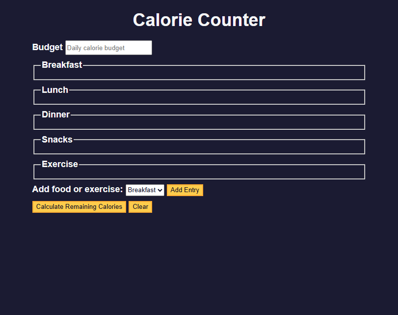
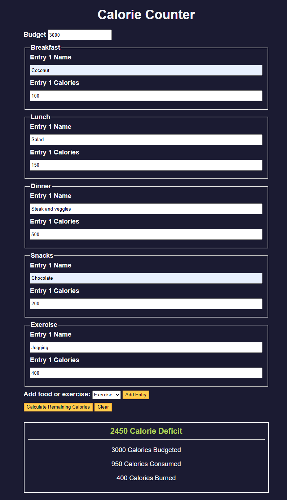

# Calorie Counter

A simple web-based app for tracking your daily calorie intake and calories burned through exercise.

## Technologies Used

- **HTML5** – Semantic structure, forms, and accessibility tags
- **CSS3** – Flexbox layout, custom properties (CSS variables), and responsive design
- **JavaScript (ES6+)** – DOM manipulation, event listeners, template literals, form handling

## Main Features

- Set a daily calorie budget
- Add multiple entries for meals (Breakfast, Lunch, Dinner, Snacks)
- Log exercise to subtract burned calories
- Calculate remaining calories dynamically
- Clear button to reset all input fields
- Dynamic message display for calorie surplus or deficit

## Setup Instructions

1. Download or clone this repository.
2. Open the `index.html` file in a modern web browser.

## How to Use It

- Enter your daily calorie budget.
- Use the dropdown to select a category (meal or exercise), then click **"Add Entry"**.
- Input item names and their calorie values.
- Click **"Calculate Remaining Calories"** to view a summary of your intake vs. budget.
- Use **"Clear"** to reset the form and start over.

## Project Status

✅ Completed for personal learning and reference, based on the [FreeCodeCamp Calorie Counter workshop](https://www.freecodecamp.org/learn/full-stack-developer/workshop-calorie-counter/).

## Screenshots

## Acknowledgements

- Guided by an exercise from [FreeCodeCamp](https://www.freecodecamp.org/)

