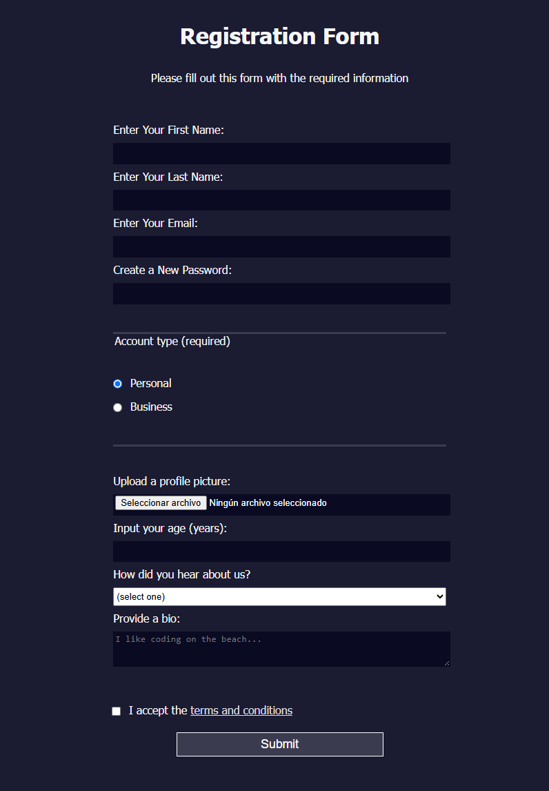

[English version](./README.md)

# Formulario de Registro

Un formulario de registro simple y responsivo, construido como parte del plan de estudios de Diseño Web Responsivo de freeCodeCamp.

## Descripción

Este proyecto muestra cómo usar HTML y CSS para crear un formulario de registro accesible y fácil de usar, con validaciones personalizadas y un diseño limpio.

## Tecnologías Usadas

- HTML5  
- CSS3  

## Funcionalidades

- Diseño responsivo usando unidades CSS como `vw`, `vh` y `rem`
- Campos requeridos con validación (ej. formato de correo, patrón de contraseña)
- Botones de opción y menús desplegables para entradas estructuradas
- Subida de archivo y restricciones de edad
- Diseño accesible con atributos `label` y `for`
- Botón de envío estilizado para coincidir con el diseño del formulario

## Instrucciones de Instalación

1. Clona o descarga este repositorio.
2. Abre `index.html` en tu navegador.
3. Asegúrate de que el archivo CSS `style.css` esté en la misma carpeta que `index.html`.

## Cómo Usarlo

Llena el formulario con la información requerida. Presiona el botón **Enviar** para simular el envío del formulario. El formulario usa el método POST para enviar los datos a un endpoint de demostración provisto por freeCodeCamp.

## Estado del Proyecto

✅ Completo – creado como parte de un ejercicio educativo.

## Capturas de Pantalla

### Vista de Escritorio

### Vista Móvil

*Captura móvil no proporcionada.*

## Agradecimientos

Este proyecto fue construido siguiendo las instrucciones del curso de freeCodeCamp:  
[Aprende Formularios HTML Construyendo un Formulario de Registro](https://www.freecodecamp.org/learn/2022/responsive-web-design/learn-html-forms-by-building-a-registration-form/)
