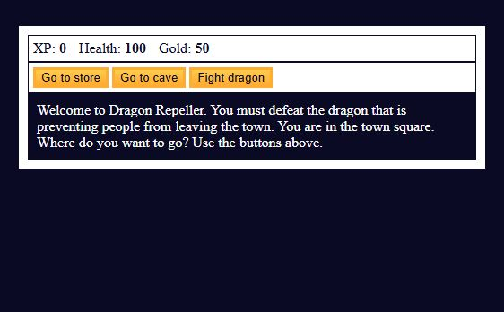
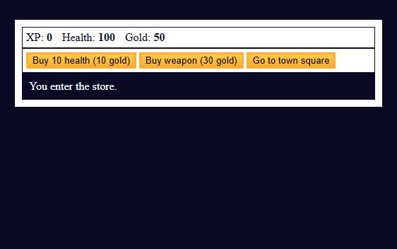
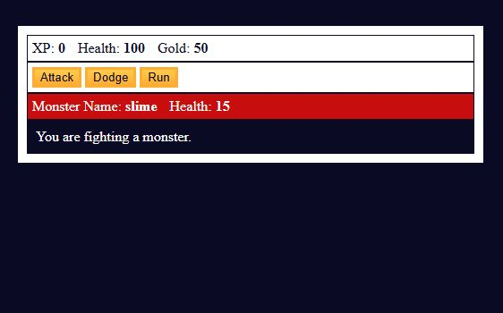
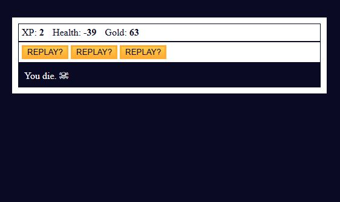

[Read this in English](README.md)

# 🕹️ Juego de Rol en JavaScript (RPG)

Un pequeño juego de rol para navegador creado con JavaScript como parte de un ejercicio de FreeCodeCamp. Introduce conceptos básicos de programación a través de una jugabilidad interactiva.

## 🚀 Tecnologías Usadas

- JavaScript
- HTML
- CSS

## 🎮 Funcionalidades Principales

- Lucha contra monstruos como babas, bestias y dragones
- Compra y vende armas
- Gana experiencia y oro
- Minijuego oculto aleatorio
- Sistema sencillo de inventario y salud

## 🛠️ Instrucciones de Instalación

1. Clona o descarga este repositorio.
2. Abre el archivo `index.html` en tu navegador web.
3. ¡Juega directamente en tu navegador — no requiere instalación!

## ▶️ Cómo Usarlo

- Haz clic en los botones para navegar por las ubicaciones y tomar decisiones.
- Gana oro y experiencia al derrotar monstruos.
- Usa el oro para comprar salud o armas más poderosas en la tienda.
- ¡Prueba el minijuego secreto para obtener recompensas adicionales!

## 📈 Estado del Proyecto

✅ Completado — todas las funcionalidades del ejercicio de FreeCodeCamp están implementadas y funcionan correctamente.

## 🖼️ Capturas de Pantalla

### Vista de Escritorio

### Vista Móvil
No proporcionada.

## 🙏 Agradecimientos

- [Ejercicio de RPG en FreeCodeCamp](https://www.freecodecamp.org/learn/javascript-algorithms-and-data-structures-v8/learn-basic-javascript-by-building-a-role-playing-game/step-1)
- Gracias especiales a la comunidad de FreeCodeCamp por su ruta de aprendizaje estructurada.
