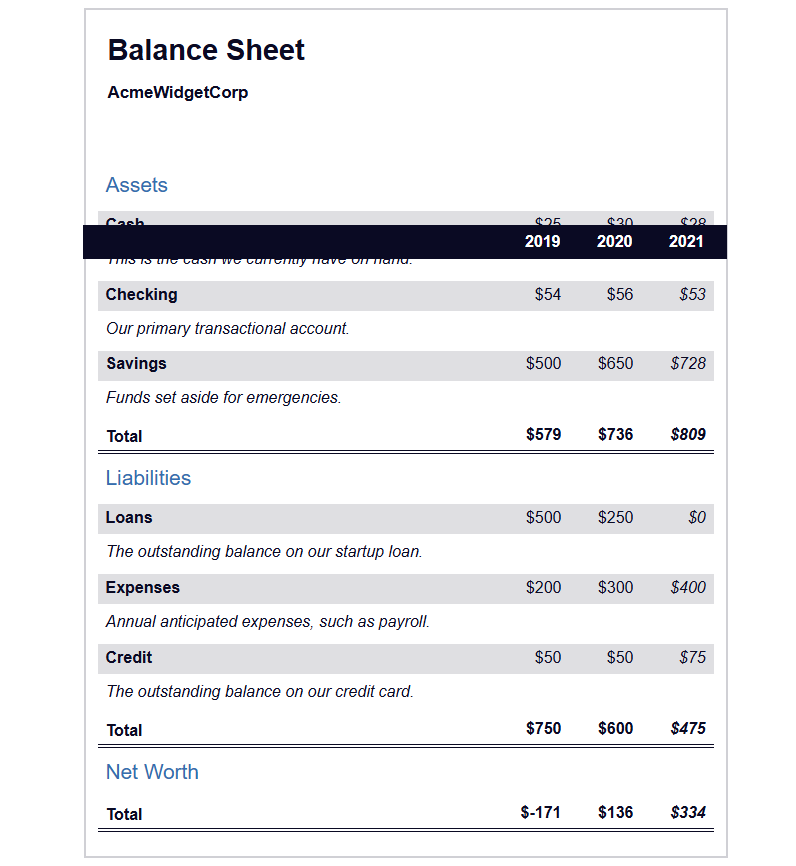

# Balance Sheet with CSS Pseudo Selectors

A hands-on project that builds a company balance sheet using semantic HTML and styled with modern CSS. This exercise focuses on using **CSS pseudo selectors** to enhance interactivity and improve visual structure without JavaScript.

## Technologies Used

- **HTML5** – Structured and semantic markup for accessibility and clarity
- **CSS3** – Custom styling with pseudo selectors like `:hover`, `:nth-of-type`, and `:last-of-type` for dynamic presentation

## Main Features

- Sticky year header using `position: sticky` for better scroll navigation
- Highlighting of current year values with pseudo classes and custom styles
- Responsive table layout for multiple screen sizes
- Descriptive content with accessible labeling using `aria-hidden` and `sr-only` classes
- Hover effects on total rows to indicate interactivity

## Setup Instructions

1. Download or clone this repository.
2. Make sure both `index.html` and `styles.css` are in the same folder.
3. Open `index.html` in any modern web browser.

## How to Use It

- Hover over the total rows to see interactive highlighting using `:hover` selectors.
- Explore how class-based selectors and pseudo selectors (`:nth-of-type`, `:last-of-type`) style different table columns.
- Inspect the layout and behavior on mobile vs desktop to understand responsive design principles.
- Use this as a template for financial or data-heavy UI layouts.

## Project Status

✅ Completed as a learning exercise for CSS pseudo selectors and semantic HTML.

## Screenshot

## Acknowledgements

- Based on [freeCodeCamp’s Balance Sheet Workshop](https://www.freecodecamp.org/learn/full-stack-developer/workshop-balance-sheet/)
- CSS pseudo selector concepts from [MDN Web Docs](https://developer.mozilla.org/en-US/docs/Web/CSS/Pseudo-classes)
