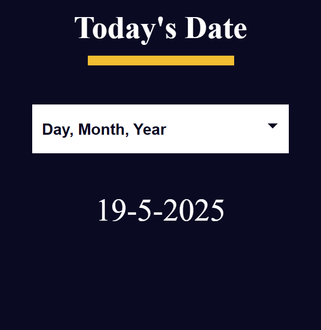
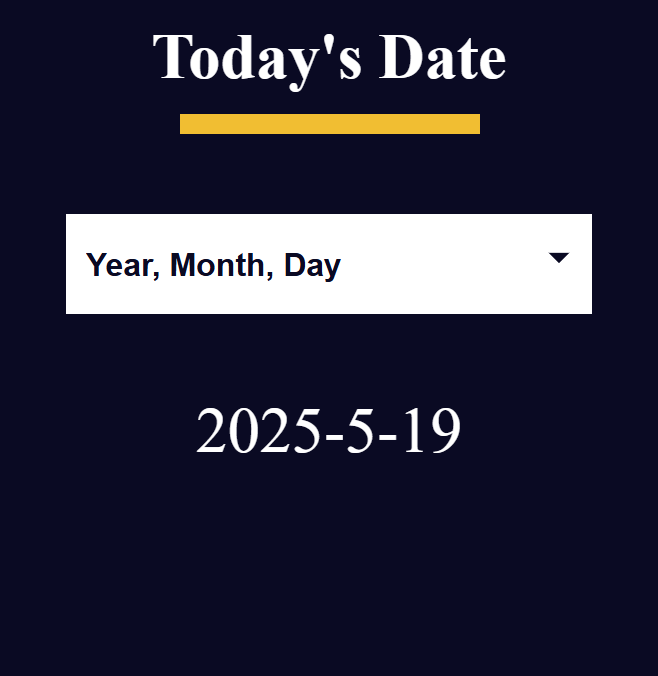
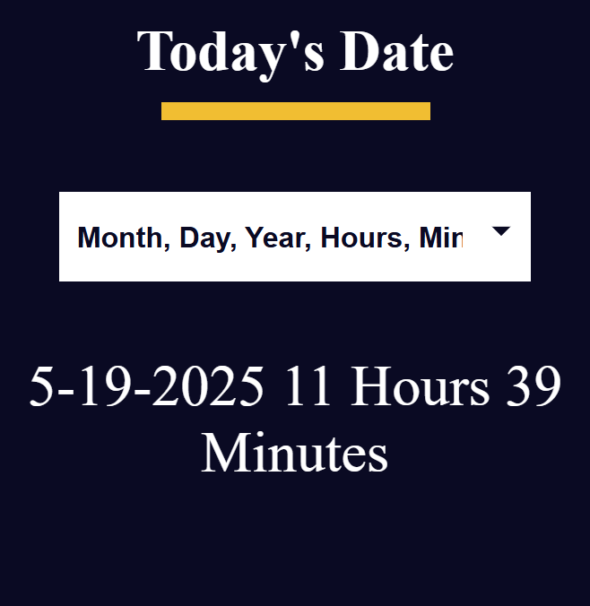

# JavaScript Date Formatter

A responsive date formatting application built with **vanilla JavaScript**, **HTML5**, and **CSS3**. This project was developed as part of freeCodeCamp’s JavaScript curriculum to gain hands-on experience with the `Date` object and practice various JavaScript string and array methods.

The tool allows users to select between multiple date formats, and instantly view the current date accordingly — all within a clean, styled interface.

---

## 🛠️ Technologies Used

- **JavaScript (ES6+)** – Core logic, working with the `Date` object, DOM manipulation, and string/array methods  
- **HTML5** – Semantic markup for structure and accessibility  
- **CSS3** – Responsive styling with Flexbox, media queries, and custom select elements  

> Tested in modern browsers supporting ES6+ features (Chrome, Firefox, Edge, Safari)

---

## ✅ Main Features

- Extracts date parts using `getDate()`, `getMonth()`, `getFullYear()`, `getHours()`, and `getMinutes()`  
- Formats the current date in multiple formats using user selection  
- Uses array methods like `.split()`, `.reverse()`, `.join()` for string transformations  
- Custom dropdown styling for consistent cross-browser appearance  
- Fully responsive design with optimized layout for small screens  
- Smooth UI transitions and accessible elements

---

## 🚀 Setup Instructions

1. Clone or download this repository to your local machine  
2. Ensure all files (`index.html`, `styles.css`, `script.js`, and the `img/` folder) are in the same directory  
3. Open `index.html` in your browser — no build tools or server setup required  

---

## 💡 How to Use

- Select one of the available date formats from the dropdown  
- The current date will immediately be displayed in the chosen format  
- The app supports three formats:
  - Day, Month, Year (e.g., 19-05-2025)
  - Year, Month, Day (e.g., 2025-05-19)
  - Month, Day, Year + Time (e.g., 05-19-2025, 14:05)

---

## 📸 Screenshots

| Format: DD-MM-YYYY | Format: YYYY-MM-DD | Format: MM-DD-YYYY, HH:MM |
|--------------------|--------------------|-----------------------------|
|  |  |  |

---

## 🧠 Exercise Link

Built as part of freeCodeCamp’s curriculum:  
[Learn the Date Object by Building a Date Formatter](https://www.freecodecamp.org/learn/javascript-algorithms-and-data-structures-v8/learn-the-date-object-by-building-a-date-formatter/)

---

## 📋 Development Step Reference

| Step | Description                                 |
|------|---------------------------------------------|
| 18   | Use `.split()`, `.reverse()`, `.join()` to reformat date strings |

---

## 📅 Project Status

✅ **Completed in May 2025**  
This project served as a practical introduction to the JavaScript `Date` object and fundamental string/array manipulation techniques used in real-world applications.

---

## 🙏 Acknowledgements

- Built as part of the **freeCodeCamp JavaScript course**  
- Thanks to the curriculum creators for providing hands-on, project-based learning  

---

