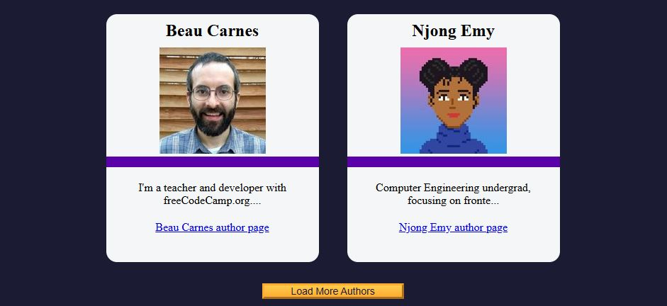
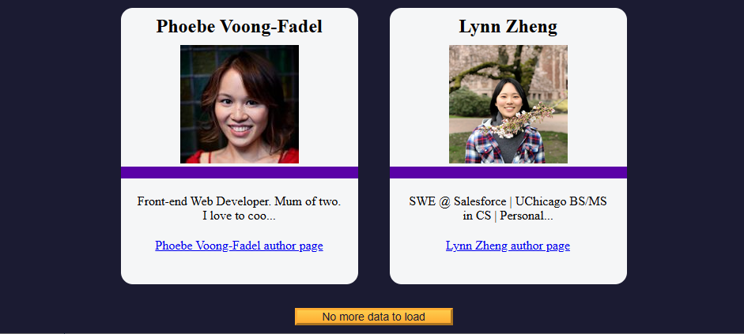

# freeCodeCamp News Author Page

A dynamic author listing page built with **vanilla JavaScript**, **HTML5**, and **CSS3**.  

It fetches author data from an external API and displays it in paginated batches, helping learners understand how to use `fetch`, handle data, and update the UI dynamically.

This project was developed as part of [freeCodeCamp’s Author Page Workshop](https://www.freecodecamp.org/learn/full-stack-developer/workshop-fcc-authors-page/), focusing on practical experience with asynchronous JavaScript and DOM manipulation.

---

## Project Status

**Completed: June 2025**  
This project was created as a hands-on exercise in using the `fetch` API, displaying JSON data, paginating results, and manipulating the DOM with JavaScript.

---

## Technologies Used

- **JavaScript (ES6+)** – Core logic using `fetch`, array methods, DOM manipulation  
- **HTML5** – Semantic and accessible markup  
- **CSS3** – Flexbox layout and theming via CSS variables  

> Tested in Chrome

---

## Features

- Fetches author data from a remote JSON API  
- Displays author cards with name, image, bio snippet, and link to author page  
- Pagination: loads data in chunks of 8 using a “Load More” button  
- Handles errors gracefully if data fails to load  
- Responsive layout using Flexbox  
- Clean, minimal design with clear visual hierarchy

> Note: This project uses `innerHTML` to inject content into the DOM, which can be problematic (e.g., XSS vulnerabilities) if working with untrusted data. It's acceptable here due to the controlled learning environment.

---

## Setup Instructions

1. Copy or download this specific project folder from your tutorials repository.  
   You can either:
   - Download the entire repository as a ZIP and extract this project folder (not recommended), or
   - Navigate to the project folder in GitHub and download files individually.

2. Open the `index.html` file in your browser:

   ```
   open index.html
   ```

   No server or build tools required — just open in your browser.

---

## Project Structure

```
.
├── index.html          # Core HTML file
├── styles.css          # Custom styling
├── script.js           # JavaScript logic for data fetching and UI updates
└── img/                # Screenshots
    ├── scsht-01.jpg
    └── scsht-02.png
```

---

## Screenshots

| Initial Load                      | After Loading More Authors        |
| --------------------------------- | --------------------------------- |
|  |  |

---

## Key JavaScript Concepts Used

| Concept              | Description                                                    |
| -------------------- | -------------------------------------------------------------- |
| `fetch()`            | Used to retrieve data asynchronously from a JSON endpoint      |
| `.slice()`           | Paginates data in fixed-size chunks                            |
| `addEventListener()` | Registers click events for interactive behavior                |
| `innerHTML`          | Renders author cards into the DOM (with caveats)               |
| Conditional logic    | Disables the "Load More" button when no more data is available |

---

## Educational Purpose

This project was designed as part of freeCodeCamp’s full stack curriculum. It’s ideal for beginners who want to:

* Understand how asynchronous JavaScript works with the `fetch` API
* Practice iterating over arrays and dynamically updating the DOM
* Implement basic client-side pagination
* Learn practical concerns like `innerHTML` usage and progressive enhancement

---

## Acknowledgements

* Built for [freeCodeCamp's Full Stack Developer Workshop](https://www.freecodecamp.org/learn/full-stack-developer/workshop-fcc-authors-page/)
* Thanks to the open-source contributors behind freeCodeCamp
