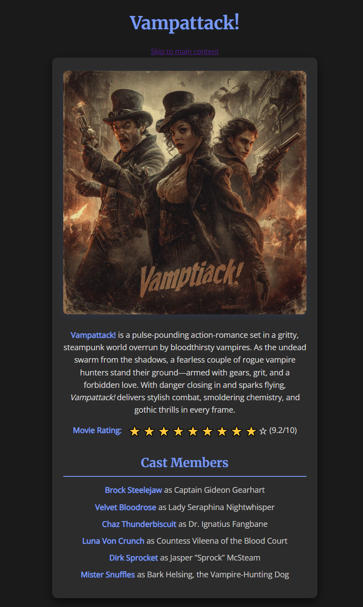
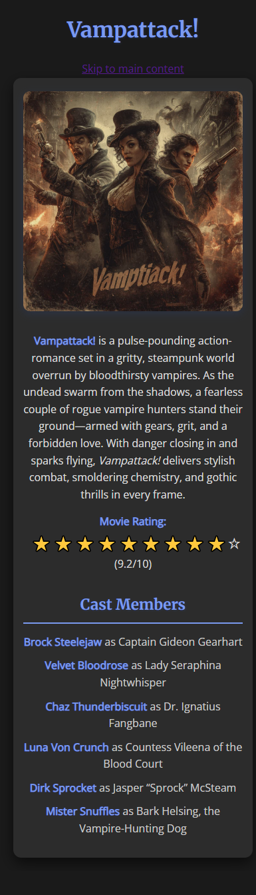

# Vampattack! – Movie Review Page

A responsive and accessible movie review page built using **semantic HTML5** and **CSS3**, based on the [freeCodeCamp Movie Review Page Lab](https://www.freecodecamp.org/learn/full-stack-developer/lab-movie-review-page/design-a-movie-review-page).

This project emphasizes the use of accessible markup techniques — including semantic roles, meaningful `alt` attributes, keyboard navigation aids, and ARIA labels — while practicing layout and typography with responsive CSS.

---

## Project Status

**Completed: June 2025**  
This page was created as part of a tutorial lab to reinforce HTML5 semantics, accessibility features, and responsive design fundamentals.

---

## Technologies Used

- **HTML5** – Clean, semantic structure using proper landmark elements  
- **CSS3** – Modern styling with variables, media queries, and hover effects  
- **Google Fonts** – Merriweather and Open Sans for typographic hierarchy

Tested in Chrome and Firefox.

---

## Features

- Fully responsive layout using Flexbox and media queries  
- Accessible semantic structure using `role` and `aria-label` attributes  
- Image with descriptive alt text for screen readers  
- Skip-link for keyboard users  
- Thematic color palette with CSS variables  
- Movie rating using emoji stars with screen reader support

---

## Setup Instructions

1. **Copy this project folder** from your tutorial archive repository.
2. Open the `index.html` file in your browser:

   ```
   open index.html
   ```

No build tools or servers required.

---

## Project Structure

```
.
├── index.html         # Semantic HTML with accessibility enhancements
├── styles.css         # Custom styling and responsive design
└── img/               # Screenshots and assets
    ├── vampattack-poster.jpg
    ├── scsht-01.png   # Full-width view
    └── scsht-02.png   # Mobile view
```

---

## Accessibility Techniques Demonstrated

| Technique                                  | Purpose                                                |
| ------------------------------------------ | ------------------------------------------------------ |
| `role="banner"`                            | Identifies the page header for screen readers          |
| `role="contentinfo"`                       | Identifies the footer landmark                         |
| `aria-label` on emojis                     | Describes star ratings for non-visual users            |
| `alt` on images                            | Provides meaningful descriptions for screen readers    |
| Skip-link                                  | Allows keyboard users to jump directly to main content |
| Semantic tags (`main`, `header`, `footer`) | Improve screen reader navigation                       |

---

## Known Issues / TODO

* On screens narrower than \~300px, the rating stars don’t currently wrap.
  ✅ *Planned fix: wrap stars and numeric rating into a flex container with wrapping enabled.*

---

## Screenshots

| Wide screen layout             | Mobile layout                    |
| ------------------------------ | -------------------------------- |
|  |  |


