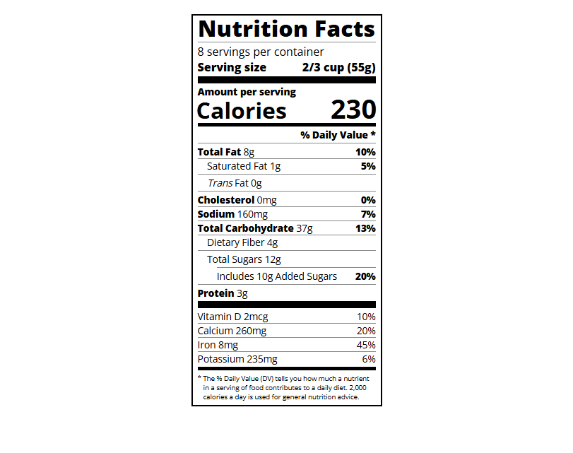

# Nutrition Label with HTML & CSS

A structured HTML/CSS project that recreates a classic Nutrition Label using typography principles and layout techniques. This exercise emphasizes the importance of type hierarchy, spacing, and visual clarity — all built with semantic HTML and custom-styled CSS.

## Technologies Used

- **HTML5** – Semantic structure and layout
- **CSS3** – Typography, spacing, Flexbox, Box Model

## Main Features

- Thoughtful use of typography: font families, sizes, and weights
- Clean visual hierarchy with bold headings and smaller subtext
- Flexbox layout for calorie and daily value alignment
- Uses CSS margin, padding, and borders to mimic real-world label structure
- Custom dividers with variable spacing and indentation

## Setup Instructions

1. Download or clone this repository.
2. Ensure both `index.html` and `styles.css` are in the same directory.
3. Open `index.html` in your web browser.

## How to Use It

- Adjust typography settings (font-size, font-weight, line height) to experiment with readability.
- Modify the layout or spacing to explore alignment and hierarchy.
- Use this project to understand how simple HTML and CSS create structured documents.

## Project Status

✅ Completed as a typography-focused layout practice exercise.

## Screenshot

## Acknowledgements

- Inspired by [freeCodeCamp’s Typography Project](https://www.freecodecamp.org/learn/2022/responsive-web-design/learn-typography-by-building-a-nutrition-label/)
  

### Quick Reference Steps

<table>
  <tr>
    <td><strong>Step 30</strong> Left Container</td>
    <td><strong>Step 31</strong> Rem units</td>
    <td><strong>Step 37</strong> Alignment of .calories-info</td>
  </tr>
  <tr>
    <td><strong>Step 41</strong> Aligned to the right</td>
    <td><strong>Step 44</strong> Alignment using nested span tags</td>
    <td><strong>Step 47</strong> .indent selector</td>
  </tr>
  <tr>
    <td><strong>Step 50</strong> :not pseudo-selector</td>
    <td><strong>Step 59</strong> Double-indent</td>
    <td></td>
  </tr>
</table>

## Other references:

- Also check: https://github.com/candytale55/my-snippets/blob/main/MD-Notes/Inline-Flex-Alignment-CheatSheet.md
