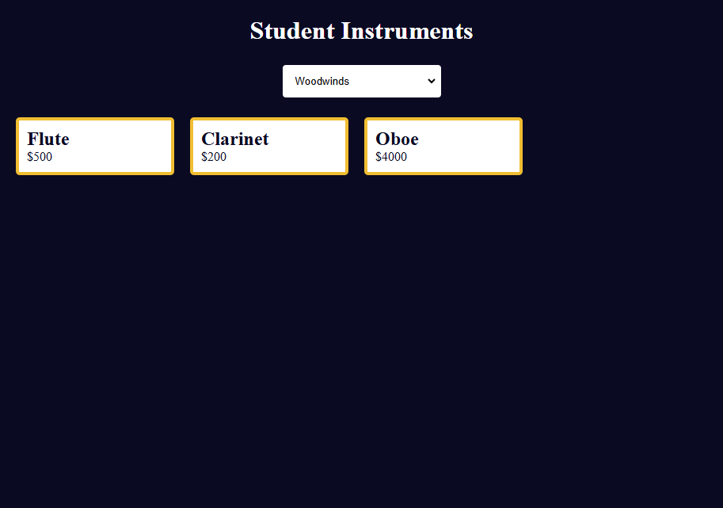

# Music Instrument Filter

A dynamic instrument catalog page built with **vanilla JavaScript**, **HTML5**, and **CSS3**.

This project allows users to filter musical instruments by category (e.g., Woodwinds, Brass, Percussion) using a dropdown menu. When a category is selected, only the relevant instruments are displayed dynamically using JavaScript.

This project was developed as part of [freeCodeCamp’s Music Instrument Filter Workshop](https://www.freecodecamp.org/learn/full-stack-developer/workshop-music-instrument-filter/), focused on hands-on learning of event handling and dynamic DOM manipulation.

---

## Project Status

**Completed: June 2025**
This project was created as a practice exercise to understand how to work with `change` events, write clean filtering logic, and update a static UI with dynamically generated content.

---

## Technologies Used

* **JavaScript (ES6+)** – Core logic with event listeners, array methods, and template literals
* **HTML5** – Semantic layout with dropdown menu and card elements
* **CSS3** – Responsive layout using Flexbox, and basic theming with CSS variables

> Fully tested in modern browsers (Chrome, Firefox)

---

## Features

* Select menu filters instruments by family: All, Woodwinds, Brass, Percussion
* Dynamically generates instrument cards using JavaScript
* Responsive layout: cards wrap on larger screens, and stack vertically on smaller screens
* Clean and minimal UI using CSS Flexbox
* Demonstrates use of the `change` event and DOM manipulation via `innerHTML`

---

## Setup Instructions

1. Copy this specific project folder from your tutorials archive repository.
2. Open the `index.html` file in your browser:

   ```bash
   open index.html
   ```

> No build tools or local server required — just a browser.

---

## Project Structure

```
.
├── index.html           # Main HTML file with dropdown and layout structure
├── styles.css           # Custom styling for layout and theming
├── script.js            # JavaScript logic for filtering and DOM updates
└── img/
    ├── screenshot-001.png   # View: All Instruments
    ├── screenshot-002.png   # View: Woodwinds
    └── screenshot-003.png   # View: Percussion
```

---

## Screenshots

| All Instruments                                 | Woodwinds                                       | Percussion                                      |
| ----------------------------------------------- | ----------------------------------------------- | ----------------------------------------------- |
|  |  |  |


---

## Key JavaScript Concepts Used

| Concept              | Description                                            |
| -------------------- | ------------------------------------------------------ |
| `addEventListener()` | Used to handle the `change` event on the dropdown menu |
| `.filter()`          | Filters the instruments by selected category           |
| `.map()`             | Transforms instrument data into HTML markup            |
| `innerHTML`          | Updates the DOM dynamically with new instrument cards  |
| Ternary operator     | Used for clean conditional logic in filtering          |

---

## Educational Purpose

* Practicing `addEventListener()` with `change` events
* Learning how to filter and transform arrays
* Updating HTML content using JavaScript
* Structuring clean and accessible HTML with reusable CSS

---

## Acknowledgements

* Built for [freeCodeCamp's Music Instrument Filter Workshop](https://www.freecodecamp.org/learn/full-stack-developer/workshop-music-instrument-filter/)
