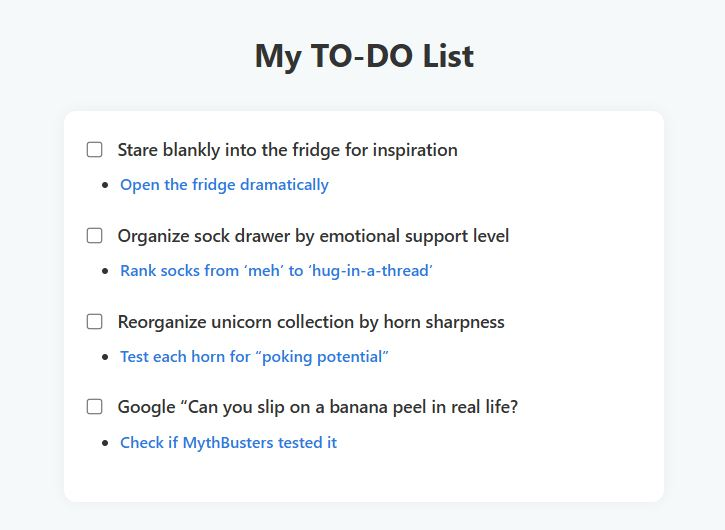

# Stylized To-Do List

A minimal HTML and CSS project focused on styling interactive links using CSS pseudo-classes.

This project was built as part of [freeCodeCamp’s "Build a Stylized To-Do List" Lab](https://www.freecodecamp.org/learn/full-stack-developer/lab-stylized-to-do-list/build-a-stylized-to-do-list), which introduces learners to link states such as `:hover`, `:focus`, `:active`, and `:visited`, while reinforcing clean HTML structure and accessibility best practices.

---

## 📌 Project Status

**Completed: June 2025**  
This lab was completed to demonstrate how to style anchor tags in various user interaction states and build a responsive, styled to-do list interface.

---

## 🎯 Learning Objectives

This project was designed to help learners:

- Apply CSS pseudo-classes to anchor elements
- Understand the order and effect of `:hover`, `:focus`, `:active`, and `:visited`
- Practice semantic HTML markup using lists, checkboxes, and labels
- Create accessible navigation through visible focus styles
- Style a basic responsive layout with minimal CSS

---

## 🛠️ Technologies Used

- **HTML5** – Semantic list structure with accessible checkboxes and labels  
- **CSS3** – Custom styles for interactive link states and responsive layout  

> Responsive design tested in Chrome, Firefox, Edge, and Safari.

---

## ✅ Features

- Anchor tags with the following styles:
  - `:hover` — changes link color on mouseover  
  - `:focus` — applies a visible outline when tabbed to  
  - `:active` — shows color change while being clicked  
  - `:visited` — displays a different color after visiting  
- Removal of default underline from anchor tags
- Subtasks presented as nested links beneath each item
- Media queries for basic responsive behavior

---

## 🧪 Educational Concepts Practiced

| Concept            | Description                                                              |
|--------------------|--------------------------------------------------------------------------|
| `text-decoration`  | Removed default underline from links                                     |
| `:hover`           | Applied color on mouse interaction                                       |
| `:focus`           | Used outline for accessibility and keyboard navigation                   |
| `:active`          | Highlighted link while being clicked                                     |
| `:visited`         | Differentiated previously visited links                                  |
| Nested lists       | Created subtasks using `<ul>` inside `<li>`                              |
| Responsive design  | Ensured visual clarity on smaller screens via media queries              |

---

## 💻 Setup Instructions

1. Copy this folder into your tutorial archive or personal projects repository.  
2. Open `index.html` directly in your browser:

```bash
open index.html
````

> No server setup or JavaScript is required.

---

## 📁 Project Structure

```
.
├── index.html          # HTML markup with to-do items and links
├── styles.css          # CSS for layout and link state styling
└── scsh-001.JPG        # Screenshot of the rendered list
```

---

## 📸 Screenshot

| Example Output                  |
| ------------------------------- |
|  |

---

## 🧠 Purpose of the Exercise

This project was created to help learners:

* Practice link state styling in a structured context
* Build a clean UI using semantic elements
* Reinforce fundamentals in CSS selectors and visual feedback
* Prepare for larger applications requiring styled navigation and interactivity

---

## 🙏 Acknowledgements

* Built for [freeCodeCamp's Stylized To-Do List Lab](https://www.freecodecamp.org/learn/full-stack-developer/lab-stylized-to-do-list/build-a-stylized-to-do-list)
* Thanks to the freeCodeCamp team!

