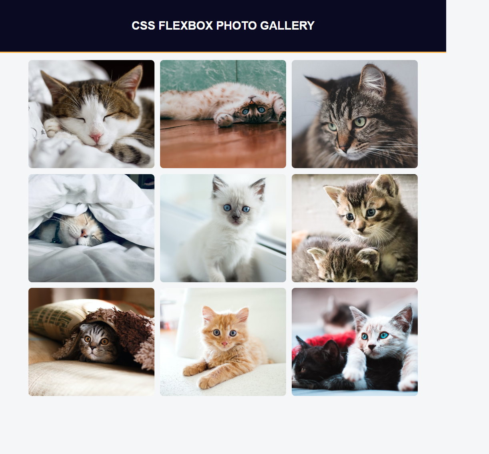

# CSS Flexbox Photo Gallery

A simple and responsive photo gallery created with HTML and CSS using the Flexbox layout model. This exercise demonstrates how Flexbox can be used to arrange items predictably on different screen sizes and browsers, making it ideal for creating dynamic, responsive layouts.

## Technologies Used

- **HTML5** – Semantic structure for layout
- **CSS3** – Flexbox layout, box model, borders, padding, and object-fit

## Main Features

- Fully responsive photo gallery layout using Flexbox
- Images arranged in a flexible, multi-column layout that adjusts based on screen size
- Customizable image dimensions and layout behavior
- Uses Flexbox properties like `justify-content`, `align-items`, and `flex-wrap` to create a responsive design
- Border-radius and object-fit applied for visual enhancement and image consistency

## Setup Instructions

1. Download or clone this repository.
2. Ensure that both `index.html` and `styles.css` are in the same directory.
3. Open `index.html` in your web browser to view the photo gallery in action.

## How to Use It

- View and explore the responsive photo gallery layout.
- Resize the browser window to see how the images automatically adjust for different screen sizes.
- Modify the images, container styles, or Flexbox properties to experiment with the layout.

## Project Status

✅ Completed as a learning exercise based on the Flexbox layout lesson.

## Screenshots

 
 
 
<!--  -->

## Exercise URL

This project is based on the freeCodeCamp exercise: [Learn CSS Flexbox by Building a Photo Gallery](https://www.freecodecamp.org/learn/2022/responsive-web-design/learn-css-flexbox-by-building-a-photo-gallery/)
